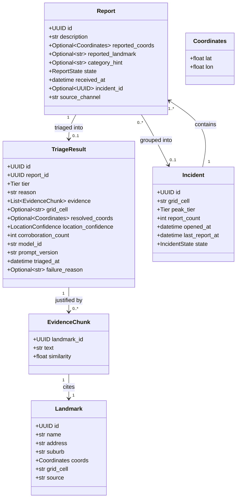
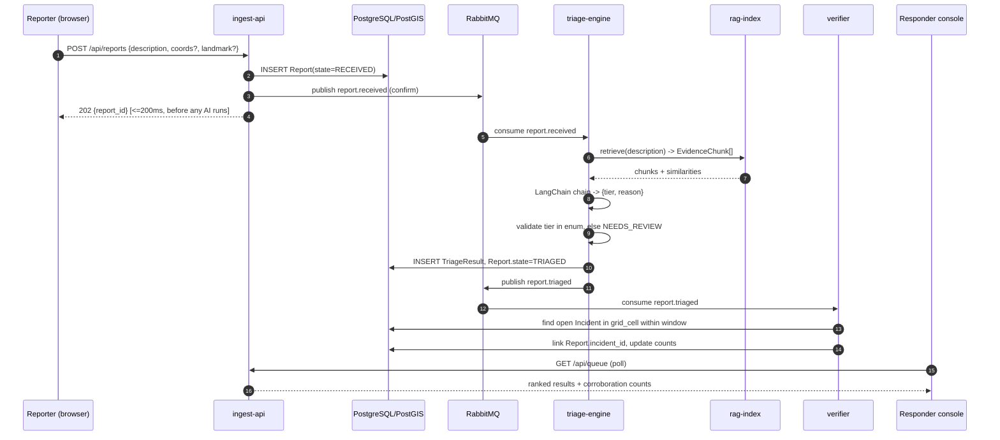
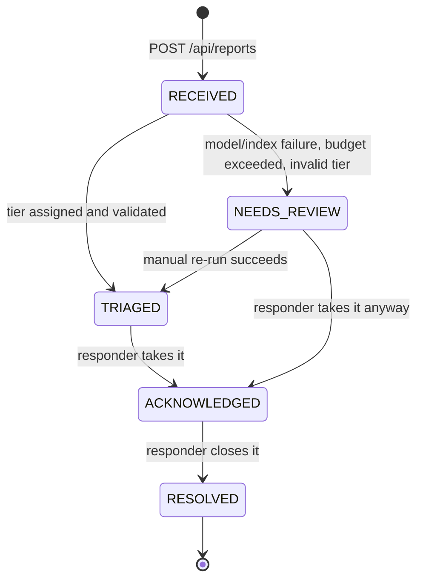

# Design — domain model (shared)

**Status:** `agreed` · **Owner:** Katlego (Claude) · **Tasks:** `T001` ·
**Spec:** user stories `US1–US6`

---

## 1. What this covers

The entities every GridLock lane reads or writes, their exact fields, the report lifecycle, and the
message payloads that cross service boundaries. This is the one document all four services build
against; a field that is not here does not exist, and adding one changes this file first, in its own
PR.

It does **not** cover per-lane internals: the LangChain chain shape is
`triage.md`, the grid/adjacency rule is `verification.md`, retrieval and
thresholds are `rag.md`, the console's component tree is
`responder-console.md`.

## 2. Reference material

| Kind | Where |
| --- | --- |
| Source brief | `GridLock Project Overview.pdf` (not in the repo) |
| Visual reference / mockup | `docs/design/assets/responder-queue.png` — **does not exist yet**; producing it is T007, and US5's implementation tasks are not written until it does |
| Design system / tokens | `apps/web/src/styles/tokens.css` — created in Phase 6, shadcn/ui base |
| Existing code this must match | none — greenfield |
| External standard / schema | WGS84 lat/lon for coordinates; ISO-8601 UTC for all timestamps |

## 3. Domain model

Every field below is a field the implementer creates. Fields absent here must not be invented.



**Invariants the diagram can't carry:**

- `Tier` is exactly `MONITOR | ADVISORY | URGENT | CRITICAL_DISPATCH`. A model response outside this
  set is **rejected**, never coerced to a neighbour — the report goes to `NEEDS_REVIEW` and the raw
  response is kept in `failure_reason`. Never invent a tier.
- `LocationConfidence` is `EXACT` (device GPS), `RESOLVED` (single landmark above threshold),
  `AMBIGUOUS` (multiple matches — `grid_cell` **must** be `null`), or `UNKNOWN` (no match —
  `grid_cell` **must** be `null`). The two nulls are enforced by a database constraint, not by
  convention, because this is the exact place a hallucinated location would enter the system.
- `reason` is one sentence, non-empty, and must quote or paraphrase only the report's own text plus
  the `evidence` chunks. It is written for a human deciding who to send.
- `corroboration_count` ≥ 1 always, and equals the number of distinct `Report` rows sharing the
  `incident_id`. It is a `COUNT(*)`, never a model output.
- All timestamps are UTC, ISO-8601, stored with timezone. `received_at` is set by `ingest-api` at
  request time — never by the client, never by the triage engine.
- `description` is stored verbatim, never rewritten, summarised, or spell-corrected. It is evidence.
- `source_channel` is `web` for the MVP; the field exists so CCTV/IoT ingestion (a stated non-goal
  now, a stated future in the brief) can be added without a schema migration.
- `prompt_version` is the versioned prompt file's identifier. Changing a prompt changes this value,
  so results stay comparable across prompt revisions.

## 4. Flow



**Failure paths — the part that otherwise gets discovered in production:**

| Step fails | What must happen |
| --- | --- |
| Publish to RabbitMQ (step 3) | The `Report` is already committed. The 202 still returns. An outbox sweep republishes when the broker returns. **The ack is never traded for the publish.** |
| `rag-index` unreachable (step 6) | Triage proceeds with `evidence = []`, `location_confidence = UNKNOWN`, `grid_cell = null`. Tier comes from the text alone. The reason states that location could not be resolved. |
| LLM errors or exceeds the 3s budget (step 8) | `Report.state = NEEDS_REVIEW`, `failure_reason` persisted, message acked (not requeued into a retry storm). It appears in the console's `Needs review` group. |
| Tier fails enum validation (step 9) | Same as above, with the raw model response in `failure_reason`. Never coerced. |
| `verifier` down (step 13) | Messages accumulate on its durable queue and drain on restart. Until then `corroboration_count = 1`, which is honest — it is the count of what has been linked so far. |
| Poison message (repeated failure) | Dead-lettered to `gridlock.dlq` after 3 delivery attempts. A report in the DLQ is a page-worthy event: it means a safety report is invisible to responders. |

## 5. State

`Report.state` — transitions not drawn here must be made impossible in code, not merely
unimplemented.



Notes:
- There is **no** transition out of `RESOLVED` and **no** deletion path. Safety reports are an audit
  trail; a mistaken close is corrected by a new report referencing the incident, not by rewriting
  history.
- `ACKNOWLEDGED` is reachable from `NEEDS_REVIEW` on purpose: a responder must be able to act on a
  report the AI could not rank. Requiring successful triage before a human can act would make an LLM
  outage into a safety outage.

`Incident.state` is `OPEN` → `MERGED` (into another incident) or `CLOSED` (all reports resolved).

## 6. Contracts

Verbatim. `packages/contracts/` is the single source; services import it rather than re-declaring.

```python
# packages/contracts/gridlock_contracts/enums.py
class Tier(str, Enum):
    MONITOR           = "MONITOR"
    ADVISORY          = "ADVISORY"
    URGENT            = "URGENT"
    CRITICAL_DISPATCH = "CRITICAL_DISPATCH"

class ReportState(str, Enum):
    RECEIVED = "RECEIVED"; TRIAGED = "TRIAGED"; NEEDS_REVIEW = "NEEDS_REVIEW"
    ACKNOWLEDGED = "ACKNOWLEDGED"; RESOLVED = "RESOLVED"

class LocationConfidence(str, Enum):
    EXACT = "EXACT"; RESOLVED = "RESOLVED"; AMBIGUOUS = "AMBIGUOUS"; UNKNOWN = "UNKNOWN"
```

**HTTP — `ingest-api`**

| Method | Path | Request | Response |
| --- | --- | --- | --- |
| POST | `/api/reports` | `{description: str (1..2000, non-blank), coords?: {lat, lon}, landmark?: str, category_hint?: str}` | `202 {report_id: UUID, received_at: datetime}` · `422` on blank/oversize description |
| GET | `/api/queue` | `?state=active\|needs_review&limit=50` | `200 {items: QueueItem[]}` ordered tier → corroboration_count → age |
| GET | `/api/reports/{id}` | — | `200 ReportDetail` · `404` |
| POST | `/api/reports/{id}/acknowledge` | — | `200 {state: "ACKNOWLEDGED"}` · `409` if already acknowledged |

```python
# QueueItem — exactly what the console renders; no extra fields, no fewer
class QueueItem(BaseModel):
    report_id: UUID
    tier: Tier | None            # None only when state == NEEDS_REVIEW
    reason: str | None           # None only when state == NEEDS_REVIEW
    corroboration_count: int     # >= 1
    grid_cell: str | None
    location_confidence: LocationConfidence
    state: ReportState
    received_at: datetime
    description: str             # verbatim
    failure_reason: str | None
```

**AMQP — exchange `gridlock` (topic, durable)**

| Routing key | Publisher | Consumer | Payload |
| --- | --- | --- | --- |
| `report.received` | ingest-api | triage-engine | `{report_id, description, reported_coords?, reported_landmark?, category_hint?, received_at}` |
| `report.triaged` | triage-engine | verifier | `{report_id, tier, grid_cell?, resolved_coords?, location_confidence, triaged_at}` |
| `report.needs_review` | triage-engine | verifier | `{report_id, failure_reason, triaged_at}` |
| `incident.updated` | verifier | (console via ingest-api reads DB) | `{incident_id, grid_cell, report_count, peak_tier}` |

Queues are durable, consumers use manual ack, publishers use confirms. Dead-letter exchange
`gridlock.dlx` → queue `gridlock.dlq` after 3 delivery attempts.

## 7. Structure

| Path | New? | Responsibility |
| --- | --- | --- |
| `packages/contracts/gridlock_contracts/enums.py` | new | the three enums above — imported, never re-declared |
| `packages/contracts/gridlock_contracts/models.py` | new | Pydantic models for every payload in §6 |
| `packages/contracts/gridlock_contracts/messages.py` | new | routing keys + envelope |
| `infra/postgres/migrations/0001_init.sql` | new | tables + the two `grid_cell IS NULL` constraints from §3 |

## 8. Decisions & alternatives

| Decision | Chosen | Rejected, and why |
| --- | --- | --- |
| Ack before or after triage | Persist + ack immediately, triage async | Synchronous triage puts an LLM in the path of a person reporting a break-in on a bad connection. Never lose a report: persist before publish, ack before triage. |
| Invalid tier from the model | Reject to `NEEDS_REVIEW` | Coercing to the nearest legal tier invents a decision nobody made — precisely the invented tier this system must never produce. |
| Ambiguous landmark | `grid_cell = null`, both chunks returned | Picking the highest-similarity hit silently manufactures a location. An ambiguous report is more useful than a confidently wrong one. |
| Corroboration source | `COUNT(*)` over linked rows | Asking the model "do these describe the same incident?" makes a dispatch-affecting number unverifiable. |
| `description` handling | Stored verbatim | Any normalisation destroys evidence and can change meaning. |
| Broker | RabbitMQ | Kafka's partitioned log buys nothing at hundreds of reports/day; per-message routing + DLQ is exactly what's needed. |

Deviations from the locked stack: none.

## 9. How this is verified

- A schema test asserts every field in §3 exists with the stated type, and that no extra columns
  were added — the diagram and the migration are checked against each other, both directions.
- Constraint tests: inserting a `TriageResult` with `location_confidence IN ('AMBIGUOUS','UNKNOWN')`
  and a non-null `grid_cell` **fails at the database**, not in application code.
- A state-machine test enumerates all `(state, transition)` pairs and asserts every pair not drawn in
  §5 raises — including `RESOLVED → anything`.
- A contract test round-trips every §6 payload through the `contracts` package and fails on an
  unknown field, so a service cannot quietly add one.
- A grounding test feeds reports whose landmarks are absent from the index and asserts
  `grid_cell is None` and that `reason` contains no suburb or landmark name absent from `evidence`.

## 10. Open questions

- [ ] **Grid cell scheme** — H3 (resolution 9, ~0.1 km²) vs. a plain geohash prefix. H3's uniform
      adjacency is worth a dependency if US4's boundary rule needs neighbours; geohash is simpler and
      has no library. Decide in `verification.md` (T004) **before** T004's
      implementation tasks are written; `grid_cell` is typed `str` here so either fits.
- [ ] **Corroboration window** — 15 minutes is written into SPEC US4 as a starting value, not a
      researched one. Needs a sanity check against how neighbourhood-watch reporting actually
      bursts before US4 ships.
- [ ] **Retrieval threshold** — the similarity cutoff separating `RESOLVED` from `UNKNOWN` is
      unset. It must be chosen from measured behaviour on the seed landmark dataset, not picked;
      a threshold guessed here becomes hallucinated locations in production. Owner: `rag.md` (T005).
- [ ] **Who defines the landmark dataset for the pilot area** — the index cannot be built without it,
      and US3 is blocked until it exists. This is a data-sourcing question, not a code question.
