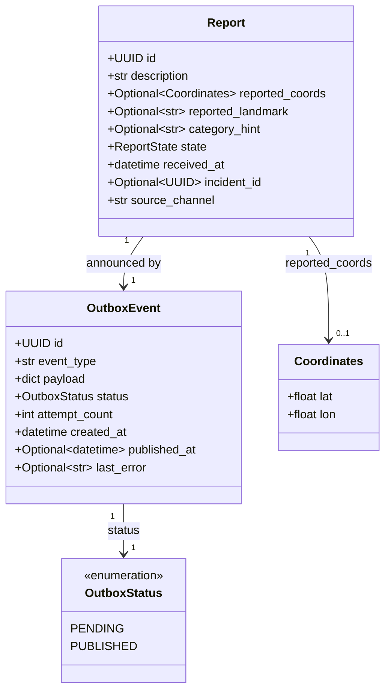
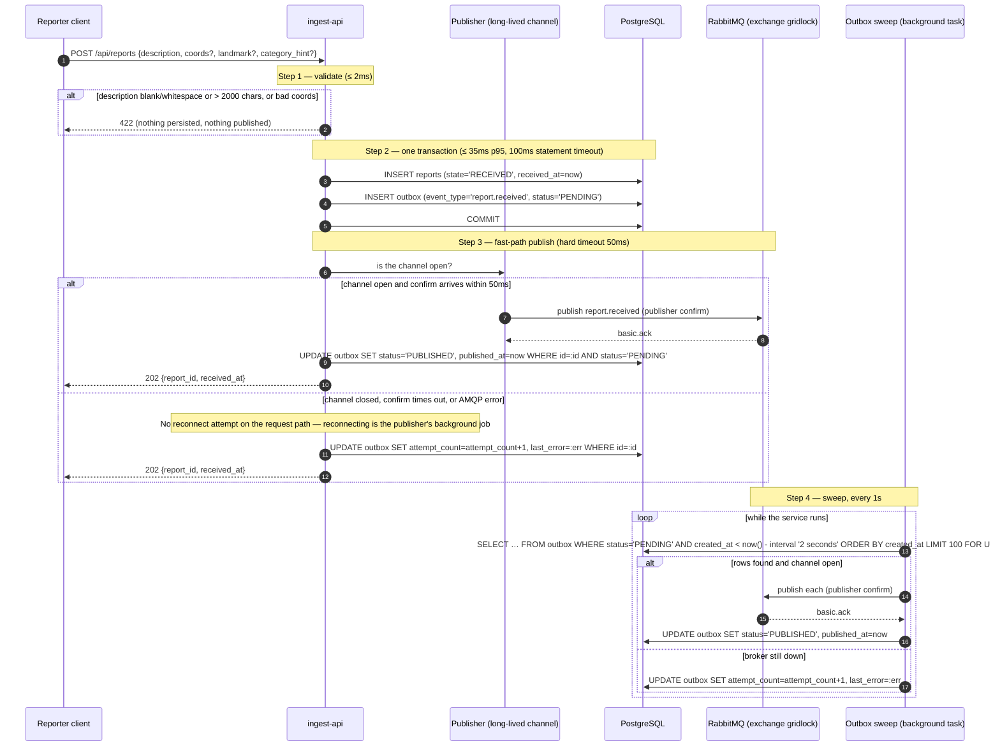
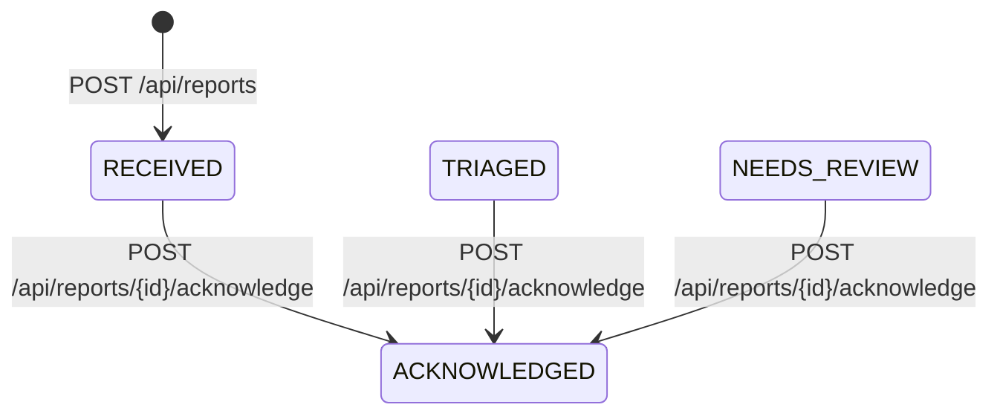
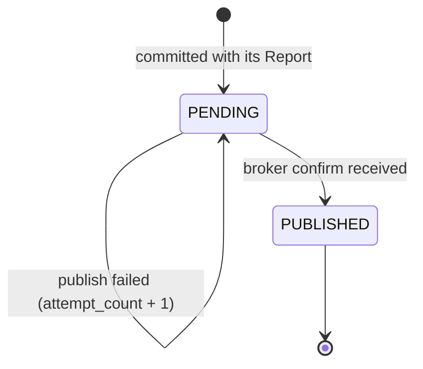

# Design — `ingest-api`

**Status:** `draft` (Phase 0 fixes under review) · **Owner:** Katlego (Gemini; revised by Claude) ·
**Tasks:** `T002` · **Spec:** `US1`, `US5` · **Domain model:** [domain-model.md](domain-model.md)

---

## 1. What this covers

`ingest-api` is GridLock's front door. It:

1. Accepts reports on `POST /api/reports`, validates them, commits them to PostgreSQL and returns
   `202` with a `report_id` in **≤ 200ms p95**, before any AI runs.
2. Guarantees that `report.received` reaches RabbitMQ even when the broker is down, through a
   transactional outbox — the ack is never traded for the publish.
3. Serves the responder queue (`GET /api/queue`): the ranked `active` group and the `needs_review`
   group, which also holds reports nobody has triaged yet.
4. Serves report detail (`GET /api/reports/{id}`) and the acknowledge action.

It does **not** cover triage (`triage.md`), corroboration (`verification.md`), the reporter app's
offline queue and GPS handling (`reporter-app.md`), or the console's components
(`responder-console.md`).

---

## 2. Reference material

| Kind | Where |
| --- | --- |
| Shared domain model | [domain-model.md](domain-model.md) §3 (`Report`, invariants), §4 (failure table), §5 (report lifecycle), §6 (HTTP + AMQP contracts, delivery semantics) |
| User stories | `US1` (submit and get an immediate ack), `US5` (ranked responder queue) |
| Governing rules | Never lose a report: persist before publish, ack before triage. Budgets: ack ≤ 200ms p95; submit → visible in the queue ≤ 5s. |
| Schema contracts | `packages/contracts/gridlock_contracts/` (`Tier`, `ReportState`, `LocationConfidence`, `QueueItem`) |

---

## 3. Domain model

`Report` and `QueueItem` are exactly as in domain-model §3/§6 and are imported from `contracts`,
never re-declared. `OutboxEvent` is private to this service.



### Invariants

1. **Verbatim description.** `description` is stored exactly as submitted — no trimming, case
   changes or spell-correction. Validation *reads* `description.strip()` to reject blank input but
   never writes the stripped value.
2. **Server time only.** `received_at` is set by `ingest-api` (`datetime.now(timezone.utc)`) when
   the request is processed. The request has no timestamp field, so there is nothing to trust.
3. **One transaction.** `INSERT Report(state=RECEIVED)` and `INSERT OutboxEvent(status=PENDING)`
   commit together or not at all.
4. **An outbox row is never given up on.** There is no `FAILED` status: a safety report that could
   not be published keeps retrying. `attempt_count` and `last_error` exist for alerting — a
   `PENDING` row older than 60s raises an alert — not for abandoning it.

---

## 4. Flow and the outbox

### 4.1 Submit: happy path and broker-down path

The fast path publishes inline, so a healthy broker gets the message in milliseconds; the sweep is
the guarantee. Both can publish the same row — that is accepted, because delivery is at-least-once
and every consumer is idempotent on `report_id` (domain-model §6).



The sweep skips rows younger than 2s so that it does not normally race the fast path for a row the
fast path is still publishing. That shrinks the duplicate window; it does not close it, and nothing
depends on it being closed.

### 4.2 Ack budget (p95 ≤ 200ms)

| Step | Operation | p95 target | Guard |
| --- | --- | --- | --- |
| 1 | Pydantic validation | 2ms | — |
| 2 | Pool checkout + two INSERTs + COMMIT | 35ms | 100ms statement timeout |
| 3 | Channel check + publish + confirm | 20ms | 50ms hard timeout |
| 3 | Outbox status UPDATE | 10ms | 100ms statement timeout |
| — | **Total, POST → 202** | **≈ 70ms** | worst case with every guard hit ≈ 250ms, which is why each guard is a *timeout*, not a retry |

The 202 is returned before the sweep or any downstream consumer runs. US1's measurement is taken
with triage stopped.

---

## 5. State

### 5.1 Report — the transitions `ingest-api` performs

Domain-model §5 is the full machine. `ingest-api` performs only these:



`RESOLVED` has no endpoint yet (domain-model §10), so this service cannot reach it.

Acknowledge is one guarded statement, so two responders racing get one `200` and one `409`:

```sql
UPDATE reports SET state = 'ACKNOWLEDGED'
 WHERE id = :id AND state IN ('RECEIVED', 'TRIAGED', 'NEEDS_REVIEW')
RETURNING state;
```

No row returned → `404` if the id does not exist, otherwise `409` (it is `ACKNOWLEDGED` or
`RESOLVED`).

### 5.2 OutboxEvent



---

## 6. Contracts

### 6.1 HTTP

Exactly domain-model §6; restated here with the codes this service returns.

| Method | Path | Request | Response |
| --- | --- | --- | --- |
| `POST` | `/api/reports` | `ReportCreateRequest` | `202 ReportCreateResponse` · `422` |
| `GET` | `/api/queue` | `?state=active\|needs_review` (default `active`), `?limit=` 1..200 (default 50) | `200 {items: QueueItem[]}` · `422` on an unknown `state` or out-of-range `limit` |
| `GET` | `/api/reports/{id}` | — | `200 ReportDetail` · `404` |
| `POST` | `/api/reports/{id}/acknowledge` | — | `200 {state: "ACKNOWLEDGED"}` · `404` · `409` |

### 6.2 Payloads

```python
from datetime import datetime
from typing import Literal
from uuid import UUID
from pydantic import BaseModel, ConfigDict, Field, field_validator
from gridlock_contracts.models import Coordinates, QueueItem  # never re-declared here

class ReportCreateRequest(BaseModel):
    model_config = ConfigDict(extra="forbid")
    description: str = Field(..., min_length=1, max_length=2000)
    coords: Coordinates | None = None
    landmark: str | None = Field(None, max_length=200)
    category_hint: str | None = Field(None, max_length=100)

    @field_validator("description")
    @classmethod
    def not_blank(cls, v: str) -> str:
        if not v.strip():
            raise ValueError("description is blank")
        return v  # the original, unstripped — it is evidence

class ReportCreateResponse(BaseModel):
    report_id: UUID
    received_at: datetime

class QueueResponse(BaseModel):
    items: list[QueueItem]

QueueState = Literal["active", "needs_review"]
```

`ReportDetail` is the `QueueItem` fields plus `reported_coords`, `reported_landmark`,
`category_hint`, `evidence`, `resolved_coords`, `incident_id`, `model_id` and `prompt_version` —
every one a column that already exists in domain-model §3.

### 6.3 Queue queries

`corroboration_count` is computed here, at read time, per domain-model §3 — there is no stored
counter to read.

```sql
-- state=active: triaged, not yet taken — tier, then corroboration, then age
SELECT r.id AS report_id, tr.tier, tr.reason,
       CASE WHEN r.incident_id IS NULL THEN 1
            ELSE (SELECT COUNT(*) FROM reports x WHERE x.incident_id = r.incident_id)
       END AS corroboration_count,
       tr.grid_cell, tr.location_confidence, r.state, r.received_at, r.description,
       tr.failure_reason
  FROM reports r
  JOIN triage_results tr ON tr.report_id = r.id
 WHERE r.state = 'TRIAGED'
 ORDER BY CASE tr.tier WHEN 'CRITICAL_DISPATCH' THEN 1 WHEN 'URGENT' THEN 2
                       WHEN 'ADVISORY' THEN 3 WHEN 'MONITOR' THEN 4 END,
          corroboration_count DESC,
          r.received_at ASC
 LIMIT :limit;

-- state=needs_review: failed triage, plus anything still untriaged after the 5s budget
SELECT r.id AS report_id, NULL AS tier, NULL AS reason,
       CASE WHEN r.incident_id IS NULL THEN 1
            ELSE (SELECT COUNT(*) FROM reports x WHERE x.incident_id = r.incident_id)
       END AS corroboration_count,
       tr.grid_cell, COALESCE(tr.location_confidence, 'UNKNOWN') AS location_confidence,
       r.state, r.received_at, r.description,
       COALESCE(tr.failure_reason, 'not yet triaged') AS failure_reason
  FROM reports r
  LEFT JOIN triage_results tr ON tr.report_id = r.id
 WHERE r.state = 'NEEDS_REVIEW'
    OR (r.state = 'RECEIVED' AND r.received_at < now() - interval '5 seconds')
 ORDER BY r.received_at ASC
 LIMIT :limit;
```

Indexes: `reports (state, received_at)`, `reports (incident_id)`, `triage_results (report_id)` unique.

### 6.4 AMQP publication

Routing key `report.received` on exchange `gridlock`; payload exactly as domain-model §6:

```json
{
  "report_id": "UUID string",
  "description": "verbatim text",
  "reported_coords": {"lat": -26.2361, "lon": 27.9068},
  "reported_landmark": "text or null",
  "category_hint": "text or null",
  "received_at": "2026-09-29T12:00:00.000000Z"
}
```

`reported_coords` is `null` when the request had none.

---

## 7. Structure

| Path | New? | Responsibility |
| --- | --- | --- |
| `services/ingest-api/pyproject.toml` | new | Pinned deps: FastAPI, uvicorn, aio-pika, psycopg, pydantic, `gridlock-contracts` |
| `services/ingest-api/src/gridlock_ingest/app.py` | new | App lifecycle: starts the publisher and the outbox sweep, error handlers |
| `services/ingest-api/src/gridlock_ingest/database.py` | new | Connection pool |
| `services/ingest-api/src/gridlock_ingest/repository.py` | new | Report + outbox inserts, guarded acknowledge, the two queue queries |
| `services/ingest-api/src/gridlock_ingest/publisher.py` | new | One long-lived channel with confirms; reconnects in the background, never on a request |
| `services/ingest-api/src/gridlock_ingest/outbox.py` | new | The sweep task |
| `services/ingest-api/src/gridlock_ingest/routes/reports.py` | new | `POST /api/reports`, `GET /api/reports/{id}`, acknowledge |
| `services/ingest-api/src/gridlock_ingest/routes/queue.py` | new | `GET /api/queue` |
| `services/ingest-api/tests/test_ingest.py` | new | Validation, persistence, ack budget |
| `services/ingest-api/tests/test_outbox_resilience.py` | new | Broker-down, recovery, duplicate-publish tolerance |
| `services/ingest-api/tests/test_queue.py` | new | Ordering at every tie, the needs-review group, acknowledge races |

---

## 8. Decisions and alternatives

| Decision | Chosen | Rejected, and why |
| --- | --- | --- |
| Broker-down durability | Transactional outbox | Publish-only: a dead broker means either a 5xx (report lost to the reporter) or a silently dropped message. |
| Outbox trigger | Inline fast path + 1s sweep | Sweep only: adds up to 1s to every report on the happy path, eating the 5s end-to-end budget. |
| Duplicate publishes | Accepted; consumers idempotent | Exactly-once via distributed locking between fast path and sweep: more moving parts to protect a property the consumers can provide cheaply. |
| Giving up on a row | Never (`FAILED` removed) | A terminal failed state for an unpublished safety report is a report lost with extra steps. |
| Untriaged reports | Shown in `needs_review` after 5s, by query | A sweeper writing a `STALE` state — a second process that can itself be down. |
| Corroboration in the queue | `COUNT(*)` at read time | Reading a stored counter the verifier maintains: it can drift from the rows it claims to count. |
| Pagination | `limit` only | `offset`/`total`: not in the agreed contract, and a queue of open safety reports is read from the top. Add via domain-model first if a real need appears. |

Deviations from the locked stack: none.

---

## 9. How this is verified

1. **Ack budget (US1).** 100 sequential valid submits with triage stopped; p95 of POST → 202 ≤ 200ms.
2. **Broker down (US1).** Stop RabbitMQ; submit; assert `202`, a `RECEIVED` report and a `PENDING`
   outbox row. Start RabbitMQ; within 5s assert the message is on the triage queue and the row is
   `PUBLISHED`.
3. **No reconnect on the request path.** With the broker down, 20 submits each complete in ≤ 200ms.
4. **Duplicate publish tolerated.** Force the fast path and the sweep to publish the same row; assert
   two messages and no error — idempotency is proved on the consumer side (`triage.md` §9).
5. **Validation.** Empty, whitespace-only and 2001-character descriptions, and an unknown field, each
   return `422` with no report and no outbox row. A description with leading spaces is stored with
   them.
6. **Queue ordering (US5).** Seed all four tiers with corroboration counts 1/3/5 and staggered times;
   assert tier → count → age at every tie, including US5's three-report scenario.
7. **Needs review holds untriaged reports.** A `RECEIVED` report 6s old appears in `needs_review`
   with `failure_reason = "not yet triaged"`; one 2s old does not appear in either group.
8. **Acknowledge.** From `RECEIVED`, `TRIAGED`, `NEEDS_REVIEW` → `200`; from `ACKNOWLEDGED` or
   `RESOLVED` → `409`; unknown id → `404`; two concurrent calls → exactly one `200`.

---

## 10. Open questions

- [ ] **Resolve action** — `ACKNOWLEDGED → RESOLVED` has no endpoint. Decided with the console
      (domain-model §10).
- [ ] **Outbox alert destination** — "a `PENDING` row older than 60s raises an alert" needs
      somewhere to send it. Belongs with `infra` (T012).
