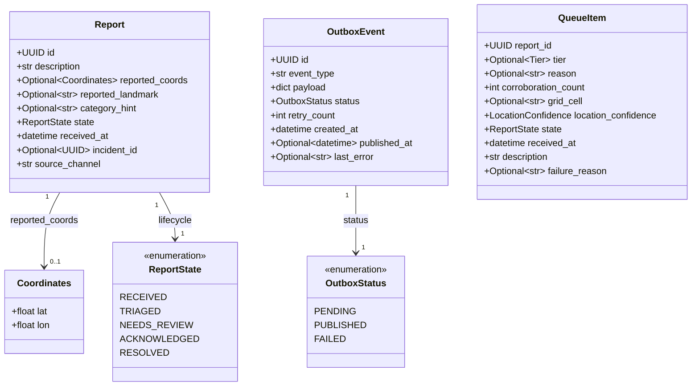
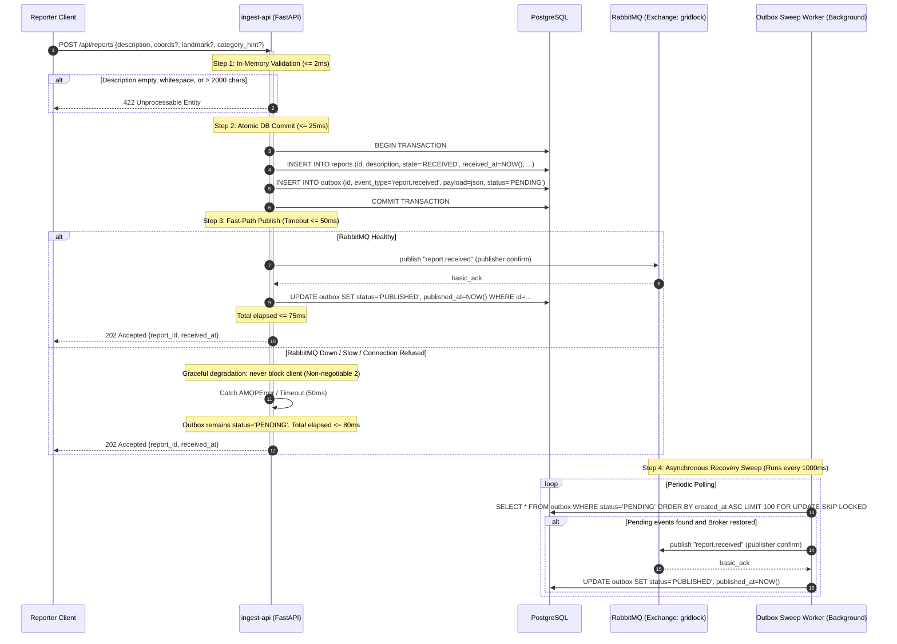
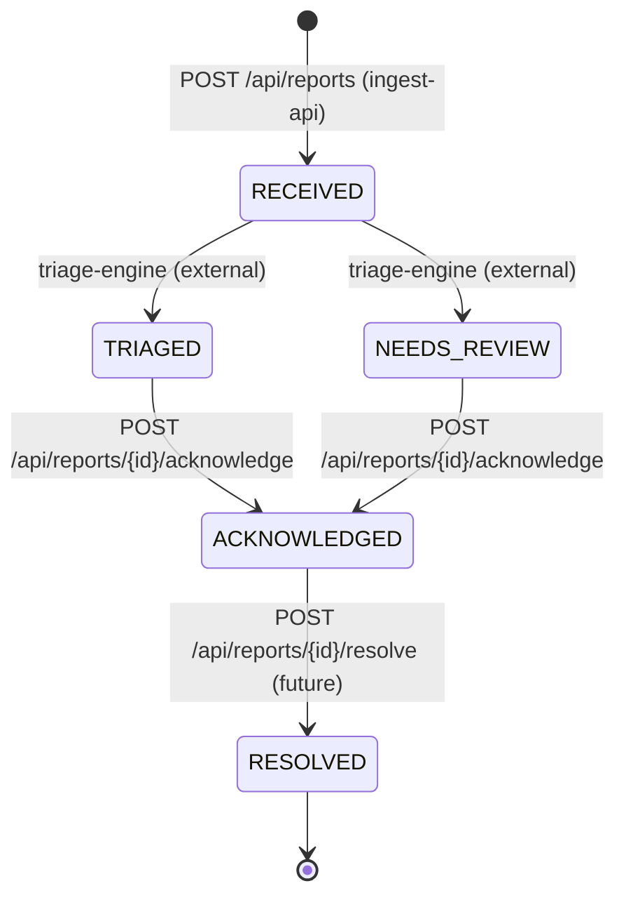

# Design — `ingest-api`

**Status:** `agreed` · **Owner:** Kamo (Gemini) · **Tasks:** `T002` ·
**Spec:** [SPEC.md](../../SPEC.md) `US1, US5` · **Domain Model:** [domain-model.md](domain-model.md)

---

## 1. What this covers

The `ingest-api` service provides the front-door HTTP interface for GridLock. It is responsible for:
1. Ingesting incident reports from residents via `POST /api/reports`, validating inputs, durably committing them to PostgreSQL, and returning a `202 Accepted` acknowledgement with a UUID reference in **≤ 200ms p95**.
2. Providing a transactional **Outbox Pattern** that guarantees `report.received` messages reach RabbitMQ even if the broker is temporarily down or slow, ensuring the ack budget is never traded for broker availability.
3. Providing the responder console queue endpoint (`GET /api/queue`) with deterministic ranking (Tier → Corroboration Count → Age), supporting filtering by active queue vs. needs-review group.
4. Providing report detail lookups (`GET /api/reports/{id}`) and state transition actions (`POST /api/reports/{id}/acknowledge`).

It explicitly does **not** cover:
- LLM triage reasoning or tier assignment (covered by `docs/design/triage.md`).
- Multi-report spatial verification (covered by `docs/design/verification.md`).
- Mobile client offline caching or device GPS acquisition (covered by `docs/design/reporter-app.md`).
- Web console frontend components (covered by `docs/design/responder-console.md`).

---

## 2. Reference material

| Kind | Where |
| --- | --- |
| Shared domain model | [docs/design/domain-model.md](domain-model.md) §3 (`Report`, `Coordinates`, `QueueItem`), §4 (flow + failure table), §5 (state machine), §6 (HTTP + AMQP contracts) |
| User stories | [SPEC.md](../../SPEC.md) `US1` (submit report and immediate ack), `US5` (responder queue) |
| Architecture principles | [PLAN.md](../../PLAN.md) Non-negotiable 1 (grounded triage), 2 (never lose a report, persist before publish, ack before triage) |
| Schema contracts | `packages/contracts/gridlock_contracts/` (`Tier`, `ReportState`, `LocationConfidence`, `QueueItem`) |

---

## 3. Domain model



### Invariants & Storage Rules

1. **Immutable Description**: `description` is stored verbatim as submitted, without stripping, capitalization normalization, or spell-correction.
2. **Server-Generated Timestamps**: `received_at` is generated by `ingest-api` at the moment of HTTP processing (`datetime.now(timezone.utc)`). Client timestamps are discarded to prevent clock skew attacks.
3. **Transaction Boundary**: The insertion of `Report(state=RECEIVED)` and `OutboxEvent(event_type='report.received', status=PENDING)` occur within the **same single database transaction**. If the transaction commits, both exist; if it aborts, neither exists.
4. **QueueItem Exclusivity**: In `QueueItem`, `tier` and `reason` are `None` if and only if `state == ReportState.NEEDS_REVIEW`.

---

## 4. Flow & The Outbox Mechanism

### 4.1 Ingestion Flow: Happy Path & Broker-Down Path

To satisfy the **≤ 200ms p95 ack budget** without sacrificing durability (Non-negotiable 2), `ingest-api` utilizes an inline fast-path publish with fallback to a background outbox sweep.



### 4.2 Step-by-Step Ack Budget Breakdown (p95 Target ≤ 200ms)

| Sequence Step | Operation | p50 Duration | p95 Duration | Timeout Guard |
|---|---|---|---|---|
| Step 1 | Pydantic model validation & sanitization check | 0.5 ms | 2 ms | N/A |
| Step 2 | Database connection pool checkout + `INSERT` Report & OutboxEvent + `COMMIT` | 12 ms | 35 ms | 100 ms statement timeout |
| Step 3 | Fast-path `aio-pika` publish with publisher confirm | 5 ms | 20 ms | 50 ms hard timeout |
| Step 3 (fallback) | Outbox catch on failure/timeout | 0.1 ms | 0.5 ms | Immediate return |
| **Total** | **End-to-End HTTP Ack (POST to 202 response)** | **~18 ms** | **~60 ms** | **< 200 ms worst-case** |

The 202 response is returned to the client before any background worker or downstream triage engine is invoked.

---

## 5. State Machine

`ingest-api` manages the initial insertion state and the responder lifecycle transitions:



### Transition Enforcement Rules

- `POST /api/reports/{id}/acknowledge`:
  - Allowed from `TRIAGED` or `NEEDS_REVIEW`.
  - If current state is `ACKNOWLEDGED`, returns `409 Conflict` (`"Report is already acknowledged"`).
  - If current state is `RESOLVED`, returns `409 Conflict` (`"Report is already resolved and cannot be modified"`).
  - If current state is `RECEIVED`, allowed as an emergency override (`200 OK`).

---

## 6. Contracts & Endpoints

### 6.1 HTTP Endpoints

| Method | Path | Request Body | Response | Error Codes |
|---|---|---|---|---|
| `POST` | `/api/reports` | `ReportCreateRequest` | `202 Accepted`: `ReportCreateResponse` | `422` (validation failure) |
| `GET` | `/api/queue` | Query params: `state: str = "active"`, `limit: int = 50`, `offset: int = 0` | `200 OK`: `QueueResponse` | `400` (invalid state query) |
| `GET` | `/api/reports/{id}` | None | `200 OK`: `ReportDetail` | `404` (not found) |
| `POST` | `/api/reports/{id}/acknowledge` | None | `200 OK`: `{"report_id": UUID, "state": "ACKNOWLEDGED"}` | `404`, `409` |

### 6.2 Verbatim Payloads (matching `domain-model.md` §6)

```python
# Request & Response Schemas
from uuid import UUID
from datetime import datetime
from pydantic import BaseModel, Field
from gridlock_contracts.enums import Tier, ReportState, LocationConfidence

class Coordinates(BaseModel):
    lat: float = Field(..., ge=-90.0, le=90.0)
    lon: float = Field(..., ge=-180.0, le=180.0)

class ReportCreateRequest(BaseModel):
    description: str = Field(..., min_length=1, max_length=2000)
    coords: Coordinates | None = None
    landmark: str | None = Field(None, max_length=200)
    category_hint: str | None = Field(None, max_length=100)

class ReportCreateResponse(BaseModel):
    report_id: UUID
    received_at: datetime

class QueueItem(BaseModel):
    report_id: UUID
    tier: Tier | None
    reason: str | None
    corroboration_count: int = Field(..., ge=1)
    grid_cell: str | None
    location_confidence: LocationConfidence
    state: ReportState
    received_at: datetime
    description: str
    failure_reason: str | None

class QueueResponse(BaseModel):
    items: list[QueueItem]
    total: int
```

### 6.3 Queue Deterministic Ordering SQL Specification

When serving `GET /api/queue?state=active`, the SQL query must sort exactly as specified in SPEC US5:

```sql
SELECT 
    r.id AS report_id,
    tr.tier,
    tr.reason,
    COALESCE(tr.corroboration_count, 1) AS corroboration_count,
    tr.grid_cell,
    COALESCE(tr.location_confidence, 'UNKNOWN') AS location_confidence,
    r.state,
    r.received_at,
    r.description,
    tr.failure_reason
FROM reports r
LEFT JOIN triage_results tr ON tr.report_id = r.id
WHERE r.state = 'TRIAGED'
ORDER BY 
    CASE tr.tier
        WHEN 'CRITICAL_DISPATCH' THEN 1
        WHEN 'URGENT'            THEN 2
        WHEN 'ADVISORY'          THEN 3
        WHEN 'MONITOR'           THEN 4
        ELSE 5
    END ASC,
    tr.corroboration_count DESC,
    r.received_at ASC
LIMIT :limit OFFSET :offset;
```

When query param `state=needs_review` is provided, the query filters by `r.state = 'NEEDS_REVIEW'` ordered by `r.received_at ASC`.

### 6.4 AMQP Publication Contract

- **Exchange**: `gridlock` (topic, durable)
- **Routing Key**: `report.received`
- **Payload**:
  ```json
  {
    "report_id": "UUID string",
    "description": "verbatim text",
    "reported_coords": {"lat": -26.2041, "lon": 28.0473} | null,
    "reported_landmark": "text" | null,
    "category_hint": "text" | null,
    "received_at": "2026-09-29T12:00:00.000000Z"
  }
  ```

---

## 7. Structure

Files created or modified in `services/ingest-api`:

| Path | New? | Responsibility |
|---|---|---|
| `services/ingest-api/pyproject.toml` | new | Dependencies: FastAPI, uvicorn, aio-pika, psycopg, pydantic |
| `services/ingest-api/src/gridlock_ingest/__init__.py` | new | Package initialization |
| `services/ingest-api/src/gridlock_ingest/app.py` | new | FastAPI application lifecycle, middleware, error handlers |
| `services/ingest-api/src/gridlock_ingest/database.py` | new | Database connection pool management |
| `services/ingest-api/src/gridlock_ingest/repository.py` | new | SQL queries for Reports, Outbox, and Queue projection |
| `services/ingest-api/src/gridlock_ingest/publisher.py` | new | `aio-pika` connection manager and message publisher |
| `services/ingest-api/src/gridlock_ingest/outbox.py` | new | Background worker task sweeping and recovering pending outbox events |
| `services/ingest-api/src/gridlock_ingest/routes/reports.py` | new | `POST /api/reports`, `GET /api/reports/{id}`, acknowledge action |
| `services/ingest-api/src/gridlock_ingest/routes/queue.py` | new | `GET /api/queue` with ordering and filtering |
| `services/ingest-api/tests/test_ingest.py` | new | Unit and integration tests for report intake and validation |
| `services/ingest-api/tests/test_outbox_resilience.py` | new | Broker-down and recovery sweep verification tests |
| `services/ingest-api/tests/test_queue_ranking.py` | new | Ordering and tie-breaking tests for the queue endpoint |

---

## 8. Decisions & Alternatives

| Decision | Chosen | Rejected, and why |
|---|---|---|
| Broker-down resiliency | Transactional Outbox Pattern | Immediate AMQP publish without outbox. Rejected: if broker is unreachable, reports would either 500 (losing reports) or fail silently (dropping messages). |
| Outbox delivery trigger | Dual mechanism: fast-path inline publish + background sweep fallback | Background-only polling. Rejected: polling alone introduces a fixed 1s latency on every report; fast-path gives <20ms latency when broker is up. |
| Ingestion ack timing | Ack immediately upon DB commit before triage | Synchronous triage before ack. Rejected: LLM p95 is ~3s and external APIs can fail; resident on 2G phone needs instant confirmation. |
| Queue rendering method | Direct SQL sorting with compound index | In-memory sorting. Rejected: in-memory sorting breaks pagination and creates race conditions across multi-instance API deployments. |

---

## 9. How this is verified

1. **Ack Budget Verification (< 200ms p95)**:
   - Benchmark test executing 100 consecutive requests to `POST /api/reports` with a healthy database; assert p95 response time is ≤ 200ms.
2. **Broker-Down Resilience Test**:
   - In a test environment, shut down or sever connections to RabbitMQ.
   - Execute `POST /api/reports` with a valid payload.
   - Assert HTTP response is `202 Accepted` with a valid UUID.
   - Assert database row exists in `reports` with `state = 'RECEIVED'`.
   - Assert database row exists in `outbox` with `status = 'PENDING'`.
   - Restore RabbitMQ connection and trigger `outbox_sweep()`.
   - Assert message is consumed from `report.received` and outbox row transitions to `PUBLISHED`.
3. **Queue Sorting Verification (US5)**:
   - Seed database with reports representing all 4 tiers, mixed corroboration counts (1, 3, 5), and mixed submission timestamps.
   - Call `GET /api/queue`.
   - Assert order strictly matches: CRITICAL_DISPATCH first, then URGENT, then ADVISORY, then MONITOR; within each tier, highest corroboration count first; within same count, oldest `received_at` first.
4. **Validation Guardrails**:
   - Blank string, whitespace-only, and 2001-character string payloads return `422 Unprocessable Entity`.

---

## 10. Open questions

- None. All endpoint contracts, budget allocations, and failure recovery sequences are fully defined.
