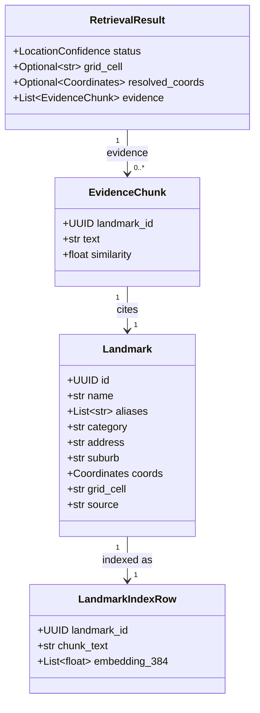
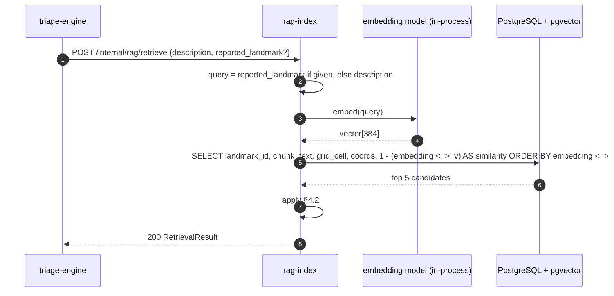
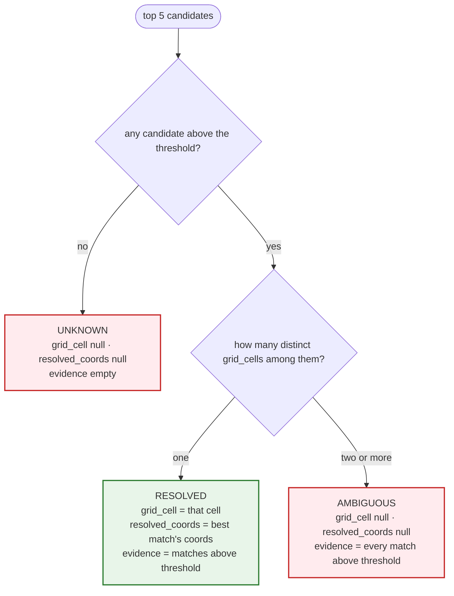

# Design — `rag-index`

**Status:** `draft` (Phase 0 fixes under review) · **Owner:** Katlego (Gemini; revised by Claude) ·
**Tasks:** `T005` · **Spec:** `US3` · **Domain model:** [domain-model.md](domain-model.md)

---

## 1. What this covers

`rag-index` turns the way people name places ("by the Spar on Vilakazi") into a grid cell — or
refuses to. It:

1. Builds a landmark index from a committed dataset (`data/landmarks/`), with one rebuild command.
2. Serves `POST /internal/rag/retrieve` to `triage-engine` and nobody else.
3. Applies the `RESOLVED` / `AMBIGUOUS` / `UNKNOWN` rule, where both refusals mean `grid_cell = null`.
4. Defines how the similarity threshold is **measured**. It does not pick one.

It never sees GPS (`EXACT` is decided in `triage.md`), never assigns tiers, and never corroborates.

---

## 2. Reference material

| Kind | Where |
| --- | --- |
| Shared domain model | [domain-model.md](domain-model.md) §3 (`Landmark`, `EvidenceChunk`), §6 (`RetrievalResult`, the retrieve endpoint), §10 (threshold, dataset) |
| User story | `US3` (ground triage in local landmarks) |
| Governing rule | Never invent a location. Sub-threshold and ambiguous matches both yield `grid_cell = null`, with evidence showing why. |
| Cells | H3 res 9 via `gridlock_contracts.geo.cell_for` ([verification.md](verification.md) §6.3) |
| Embedding model | `sentence-transformers/all-MiniLM-L6-v2`, 384 dimensions, cosine — provisional, §11 |

---

## 3. Domain model

`Landmark`, `EvidenceChunk` and `RetrievalResult` are exactly domain-model §3/§6. The index row adds
two storage-only columns that never leave this service.



### Invariants

1. **Only a landmark can place a report.** `grid_cell` and `resolved_coords` in a `RESOLVED` result
   are copied from the matched landmark. Nothing is interpolated, averaged or inferred.
2. **Both refusals are null.** `AMBIGUOUS` and `UNKNOWN` carry `grid_cell = null` and
   `resolved_coords = null`.
3. **Evidence shows the reasoning.** `UNKNOWN` → `evidence = []`. `RESOLVED` → the matches above the
   threshold (all in one cell). `AMBIGUOUS` → every match above the threshold, across all its cells,
   so a responder sees each candidate.
4. **Cells are computed, not typed.** A landmark's `grid_cell` is `cell_for(lat, lon)` at build time.
   The dataset file has no `grid_cell` field to get wrong.
5. **One threshold, measured, not overridable.** `RETRIEVAL_THRESHOLD` is a config value set from a
   recorded calibration run (§6). The request cannot change it.
6. **Same model both sides.** Index and query use the same pinned model revision; the build refuses
   to run against an index built by a different revision.
7. **`EvidenceChunk.text` is the chunk text exactly** as §5.2 builds it.

---

## 4. Flow and the decision rule

### 4.1 Retrieval



The landmark the reporter typed is the better query when it exists: it is short and about a place,
while a full description embeds mostly the incident ("men with a gun…") and matches landmarks
weakly and unpredictably. When there is no landmark field, the description is the only signal and
the threshold is what keeps a weak match from becoming a location.

### 4.2 The decision rule

`above` = candidates with `similarity ≥ RETRIEVAL_THRESHOLD`.



There is no similarity-gap rule ("pick the top hit if it wins by Δ"). Two Shoprites differ in their
chunk text by address and suburb, so their scores can differ by any amount for reasons unrelated to
which one the reporter meant. A gap rule would resolve one of them some of the time, which is
exactly the picked-first-hit behaviour US3 forbids. If calibration shows the rule above loses too
much recall, a margin can be added — with its value measured by the same procedure, recorded in §8,
never picked.

---

## 5. Dataset and chunking

### 5.1 Source schema — `data/landmarks/pilot_area.jsonl`

One JSON object per line. The values below illustrate the shape and are **not** seed data; every
real row must come from a named source.

```json
{"id": "7b89d4e5-6f1a-4d2b-9e3c-8f1a2b3c4d5e", "name": "Spar Vilakazi", "aliases": ["Vilakazi Spar"],
 "category": "supermarket", "address": "Vilakazi Street", "suburb": "Orlando West",
 "lat": -26.2361, "lon": 27.9068, "source": "<dataset name and licence>"}
```

The build rejects a row with an unknown field, a missing required field, or coordinates outside the
pilot-area bounding box.

### 5.2 Chunk text

One chunk per landmark:

```
{name} ({aliases, comma-separated}) — {category}, {address}, {suburb}
```

The parenthesised part is omitted when there are no aliases. Example:
`Spar Vilakazi (Vilakazi Spar) — supermarket, Vilakazi Street, Orlando West`.

### 5.3 Rebuild

`uv run python -m gridlock_rag.build data/landmarks/pilot_area.jsonl` truncates and rebuilds the
index in one transaction: validate every row, compute each cell with `cell_for`, build chunk text,
embed, insert. Running it twice gives an identical index.

---

## 6. Threshold calibration

Run once the pilot dataset exists, in the Phase 4 calibration task (not yet written — it is blocked
on the dataset), and again whenever the dataset or model changes.

1. **Corpus.** Query phrases written the way reports are written, each labelled by a person with the
   landmark it means, or `none`, or `ambiguous`:
   - at least 60 that name a pilot-area landmark, with misspellings, prepositions and code-switched
     English/isiZulu/Sesotho/Afrikaans phrasing ("eduze kwe-Spar e-Vilakazi");
   - at least 100 that name no pilot-area landmark — other cities' landmarks, invented places, and
     incident text with no place in it;
   - at least 30 that name a chain with several pilot-area branches and no disambiguator.
2. **Sweep.** For thresholds 0.30 to 0.95 in steps of 0.01, run the full §4.2 rule and record:
   - **false placement rate** — `none` or `ambiguous` queries that came back `RESOLVED`, plus
     landmark queries resolved to the *wrong* cell;
   - **recall** — landmark queries resolved to the right cell;
   - **ambiguity recall** — `ambiguous` queries that came back `AMBIGUOUS`.
3. **Select.** The lowest threshold with a false placement rate of zero. With 100 negatives, "zero
   observed" still allows a true rate up to about 3% (the rule of three), so the corpus sizes above
   are minimums, not targets. If recall at that threshold is below 70%, stop and report it — that is
   a finding about the dataset or model, not a reason to lower the bar.
4. **Record.** `RETRIEVAL_THRESHOLD` goes in `services/rag-index/src/gridlock_rag/config.py` beside
   the model revision and the path of the committed calibration report
   (`services/rag-index/calibration/<date>.md`: corpus hash, the full sweep table, the choice).

Until that run exists, the service **refuses to start**. There is no default threshold.

---

## 7. Contract

`POST /internal/rag/retrieve` — exactly domain-model §6. No `limit`, no `threshold`: both are fixed
by this service.

```json
{"description": "break-in at the Spar on Vilakazi", "reported_landmark": null}
```

`RESOLVED`:

```json
{
  "status": "RESOLVED",
  "grid_cell": "89bcc3cc96bffff",
  "resolved_coords": {"lat": -26.2361, "lon": 27.9068},
  "evidence": [
    {"landmark_id": "7b89d4e5-6f1a-4d2b-9e3c-8f1a2b3c4d5e",
     "text": "Spar Vilakazi (Vilakazi Spar) — supermarket, Vilakazi Street, Orlando West",
     "similarity": 0.81}
  ]
}
```

`AMBIGUOUS` — two branches, two cells:

```json
{
  "status": "AMBIGUOUS",
  "grid_cell": null,
  "resolved_coords": null,
  "evidence": [
    {"landmark_id": "…", "text": "Shoprite Orlando — supermarket, …, Orlando East", "similarity": 0.78},
    {"landmark_id": "…", "text": "Shoprite Meadowlands — supermarket, …, Meadowlands", "similarity": 0.76}
  ]
}
```

`GET /health` → `200` once the model is loaded and the index is non-empty; `503` otherwise.
Latency target: p95 ≤ 150ms, inside triage's 300ms timeout.

---

## 8. Structure

| Path | New? | Responsibility |
| --- | --- | --- |
| `data/landmarks/pilot_area.jsonl` | new | The committed dataset (blocked on sourcing, §11) |
| `services/rag-index/pyproject.toml` | new | Pinned deps: FastAPI, uvicorn, sentence-transformers (CPU torch), pgvector, psycopg, `gridlock-contracts` |
| `services/rag-index/src/gridlock_rag/app.py` | new | `/internal/rag/retrieve`, `/health`; refuses to start without a calibrated threshold |
| `services/rag-index/src/gridlock_rag/config.py` | new | Model name + pinned revision, `RETRIEVAL_THRESHOLD`, calibration report path |
| `services/rag-index/src/gridlock_rag/embedder.py` | new | Loads the pinned model; `embed(text) -> list[float]` |
| `services/rag-index/src/gridlock_rag/retriever.py` | new | Vector query + the §4.2 rule as a pure function |
| `services/rag-index/src/gridlock_rag/build.py` | new | The §5.3 rebuild |
| `services/rag-index/src/gridlock_rag/calibrate.py` | new | The §6 sweep, writing the report |
| `services/rag-index/tests/test_decision_rule.py` | new | §4.2 on hand-built candidate lists |
| `services/rag-index/tests/test_retrieval.py` | new | End-to-end against a small real index |
| `services/rag-index/tests/test_build.py` | new | Validation, computed cells, idempotent rebuild |

---

## 9. Decisions and alternatives

| Decision | Chosen | Rejected, and why |
| --- | --- | --- |
| Ambiguity | Two or more cells above the threshold → `AMBIGUOUS` | A similarity-gap rule: resolves same-named shops by accident of wording (§4.2). |
| Query text | The reporter's landmark field when present | Always the full description: it embeds the incident, not the place. |
| Threshold override in the request | None | A caller-supplied threshold is a way around the one number keeping locations honest. |
| Embeddings | Local model, in-process | A hosted embedding API: a network hop inside a 300ms budget, a per-report cost, and a failure mode unrelated to the index. |
| Vector store | `pgvector` in the existing PostgreSQL | A separate vector database: one more container for a few thousand rows. |
| Cells in the dataset | Computed at build time | Typed into the file: the first draft of this doc carried a hand-written cell that was wrong. |

Deviations from the locked stack, recorded here: the `pgvector` extension in PostgreSQL, and
`sentence-transformers`, which brings PyTorch into the `rag-index` image (CPU build only; the image
size is to be measured in T012 against any size budget).

---

## 10. How this is verified

1. **Decision rule** — hand-built candidate lists: none above → `UNKNOWN`; several above in one cell
   → `RESOLVED` with all of them as evidence; above in two cells → `AMBIGUOUS` with both. No
   similarity values beyond the threshold influence the outcome.
2. **US3 single hit** — a small real index containing the Spar row; query "break-in at the Spar on
   Vilakazi" → `RESOLVED`, `grid_cell == cell_for(-26.2361, 27.9068)`, evidence cites the Spar.
3. **US3 two Shoprites** — two Shoprite rows in different cells; "robbery at the Shoprite" →
   `AMBIGUOUS`, `grid_cell is None`, both in evidence.
4. **US3 not in index** — "emergency at the Eiffel Tower" → `UNKNOWN`, empty evidence.
5. **Landmark field preferred** — description with no place + `reported_landmark` "Vilakazi Spar"
   → resolves to the Spar.
6. **No override** — a request with `threshold` or `limit` → `422`.
7. **No threshold, no start** — the app refuses to start when `RETRIEVAL_THRESHOLD` is unset.
8. **Rebuild** — running the build twice gives identical rows; a row with a bad field fails the
   whole build.

---

## 11. Open questions

- [ ] **The pilot dataset** — which area, which source, which licence. US3 is blocked until it is
      committed (domain-model §10).
- [ ] **The embedding model's languages** — `all-MiniLM-L6-v2` was trained on English. Reports here
      code-switch. The calibration corpus includes code-switched queries so the gap is *measured*;
      if recall on them is poor, a multilingual model is the fix, chosen by rerunning §6 on each
      candidate.
- [ ] **Model revision** — the exact Hugging Face revision hash is recorded when the service is
      scaffolded, and never floats.
