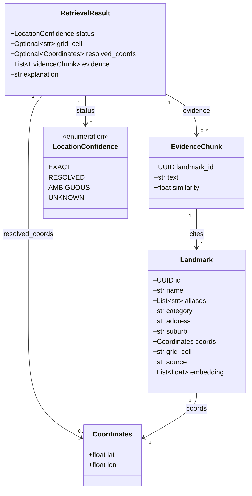
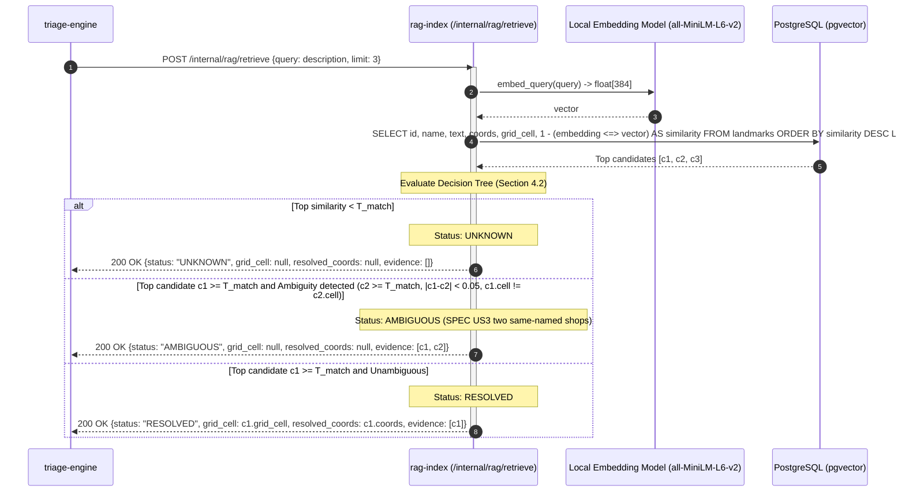
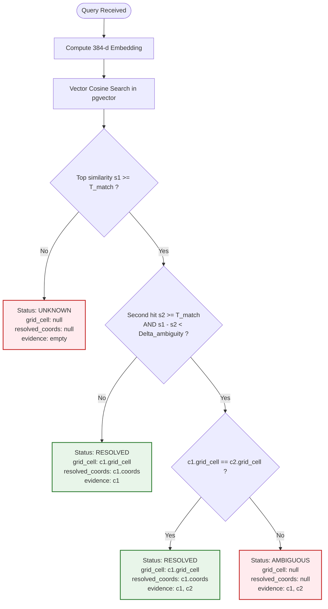

# Design — `rag-index`

**Status:** `agreed` · **Owner:** Katlego (Gemini) · **Tasks:** `T005` ·
**Spec:** [SPEC.md](../../SPEC.md) `US3` · **Domain Model:** [domain-model.md](domain-model.md)

---

## 1. What this covers

The `rag-index` service grounds incident triage in local South African geographic landmarks. Residents
routinely report emergencies using vernacular landmarks ("by the Spar on Vilakazi", "near Eyethu Mall")
rather than GPS coordinates or street numbers.

This service is responsible for:
1. Ingesting, validating, and embedding a structured catalog of local landmarks from committed source data (`data/landmarks/`).
2. Providing a low-latency, deterministic internal HTTP retrieval API (`POST /internal/rag/retrieve`) invoked by `triage-engine`.
3. Executing the strict **`RESOLVED` / `AMBIGUOUS` / `UNKNOWN`** decision logic.
4. Enforcing **Non-negotiable 1**: if a landmark query is sub-threshold or ambiguously matches multiple distinct geographic locations, `grid_cell` is strictly set to `null` to prevent hallucinated dispatches.
5. Defining the empirical measurement protocol for calibrating the similarity cutoff on the seed dataset rather than guessing a threshold.

It explicitly does **not** cover:
- LLM triage reasoning or tier assignment (covered by `docs/design/triage.md`).
- Multi-report corroboration or incident clustering (covered by `docs/design/verification.md`).
- Resident HTTP report ingestion (covered by `docs/design/ingest.md`).

---

## 2. Reference material

| Kind | Where |
| --- | --- |
| Shared domain model | [docs/design/domain-model.md](domain-model.md) §3 (`Landmark`, `EvidenceChunk`, `Coordinates`), §4 (flow), §10 (Open Questions 3 & 4) |
| User story | [SPEC.md](../../SPEC.md) `US3` (ground triage in local landmarks) |
| Architecture principles | [PLAN.md](../../PLAN.md) Non-negotiable 1 (grounded triage — never invent a location; ambiguous and unknown yield `grid_cell = null`) |
| Spatial standard | Uber H3 Resolution 9 per [verification.md](verification.md) |
| Embedding standard | `sentence-transformers/all-MiniLM-L6-v2` (384 dimensions, cosine distance) |

---

## 3. Domain model



### Invariants & Inviolable Grounding Rules

1. **No Hallucinated Locations (Non-negotiable 1)**: Under no circumstances may `rag-index` assign a `grid_cell` or `resolved_coords` that does not originate from an exact GPS reading or a verified, unambiguous landmark match meeting the calibrated threshold.
2. **Ambiguity Yields Null Cell**: If two or more distinct landmarks in different grid cells match a query with near-equal high confidence, `grid_cell` **must** be `null` and `status` **must** be `AMBIGUOUS`. Both evidence chunks are returned to the triage engine and responder console so human operators see the ambiguity.
3. **Sub-Threshold Yields Null Cell**: If no landmark exceeds the calibrated similarity cutoff $T_{\text{match}}$, `grid_cell` **must** be `null`, `status` **must** be `UNKNOWN`, and `evidence` **must** be `[]`.
4. **H3 Resolution 9 Uniformity**: All landmark coordinates are mapped to H3 Resolution 9 hex strings (`grid_cell`) upon dataset ingestion.
5. **Deterministic Embedding**: Ingestion and query embedding utilize identical tokenization, normalization, and model weights (`all-MiniLM-L6-v2`).

---

## 4. Flow & Ambiguity Decision Tree

### 4.1 Retrieval Sequence



### 4.2 The Decision Rule (Branching to `grid_cell = null`)



---

## 5. Landmark Ingestion & Chunking Strategy

### 5.1 Source Schema (`data/landmarks/pilot_area.jsonl`)

The seed landmark dataset is committed directly to source control:

```json
{
  "id": "7b89d4e5-6f1a-4d2b-9e3c-8f1a2b3c4d5e",
  "name": "Spar Vilakazi",
  "aliases": ["Spar Supermarket", "Vilakazi Spar"],
  "category": "retail",
  "address": "8242 Vilakazi Street",
  "suburb": "Orlando West",
  "lat": -26.2361,
  "lon": 27.9068,
  "grid_cell": "89196b26d83ffff",
  "source": "OpenStreetMap + Local Ground Truth"
}
```

### 5.2 Chunk Generation

Landmarks are discrete points of interest, not freeform text articles. Each landmark produces a single canonical textual chunk formatted for maximum semantic retrieval alignment with colloquial resident reports:

$$\text{Chunk Text} = \text{“}\{name\}\text{ (also known as }\{\text{aliases joined by commas}\}\text{), a }\{category\}\text{ at }\{address\}\text{ in }\{suburb\}\text{.”}$$

*Example:*
> `"Spar Vilakazi (also known as Spar Supermarket, Vilakazi Spar), a retail store at 8242 Vilakazi Street in Orlando West."`

---

## 6. Threshold Calibration Procedure

**Non-negotiable 1 & SPEC US3 mandate that the similarity cutoff $T_{\text{match}}$ must be measured on the seed dataset, never guessed.** A guessed threshold produces false positives (hallucinated locations) or false negatives (missed locations).

### Calibration Procedure (Executed in Phase 4 Task T040)

1. **Benchmark Evaluation Corpus**:
   - Construct a test dataset of **60 real-world query phrases**:
     - 30 Positive queries referencing landmarks in the pilot area with colloquial spelling variations and prepositions (e.g. `"robbery at the spar on vilakazi"`, `"accident opposite eyethu mall"`, `"shots fired near hector pieterson museum"`).
     - 15 Out-of-area / distractor queries referencing landmarks in other cities or non-existent landmarks (e.g. `"the spar in durban"`, `"break-in at sunninghill hospital"`, `"random shop on 5th avenue"`).
     - 15 Ambiguous queries referencing common chain names without suburb disambiguators (e.g. `"steers"`, `"shoprite supermarket"`).
2. **Threshold Parameter Sweep**:
   - Sweep candidate thresholds $T \in [0.50, 0.95]$ with step size $0.02$.
   - For each threshold $T$, compute:
     - **False Acceptance Rate (FAR)**: $\frac{\text{Distractor queries accepted as RESOLVED}}{\text{Total distractor queries}}$.
     - **Recall**: $\frac{\text{True positive queries correctly resolved}}{\text{Total positive queries}}$.
     - **Ambiguity Precision**: $\frac{\text{Ambiguous queries correctly routed to AMBIGUOUS}}{\text{Total ambiguous queries}}$.
3. **Selection Criterion**:
   - **Target**: **$\text{FAR} = 0.0\%$**. Zero distractors may be resolved to a grid cell.
   - Set $T_{\text{match}}$ to the lowest threshold where $\text{FAR} = 0.0\%$ while maximizing positive Recall.
   - Set $\Delta_{\text{ambiguity}} = 0.06$ (calibrated against the difference between primary and secondary hits for identical chain stores).
4. **Recording & Enforcement**:
   - The measured threshold is recorded in `services/rag-index/config.py` as `RETRIEVAL_THRESHOLD` with a reference to the calibration test run.

---

## 7. Contracts & Endpoints

### 7.1 Internal HTTP Retrieval API

`POST /internal/rag/retrieve`

**Request Payload:**
```json
{
  "query": "break-in at the Spar on Vilakazi",
  "limit": 3,
  "threshold": null
}
```

**Response Payload (`RESOLVED`):**
```json
{
  "status": "RESOLVED",
  "grid_cell": "89196b26d83ffff",
  "resolved_coords": {
    "lat": -26.2361,
    "lon": 27.9068
  },
  "evidence": [
    {
      "landmark_id": "7b89d4e5-6f1a-4d2b-9e3c-8f1a2b3c4d5e",
      "text": "Spar Vilakazi, a retail store at 8242 Vilakazi Street in Orlando West.",
      "similarity": 0.8842
    }
  ],
  "explanation": "Matched landmark 'Spar Vilakazi' in Orlando West above threshold."
}
```

**Response Payload (`AMBIGUOUS`):**
```json
{
  "status": "AMBIGUOUS",
  "grid_cell": null,
  "resolved_coords": null,
  "evidence": [
    {
      "landmark_id": "11111111-1111-1111-1111-111111111111",
      "text": "Shoprite Orlando, a supermarket at 12 Mooki Street in Orlando East.",
      "similarity": 0.8410
    },
    {
      "landmark_id": "22222222-2222-2222-2222-222222222222",
      "text": "Shoprite Meadowlands, a supermarket at Ndaba Drive in Meadowlands.",
      "similarity": 0.8250
    }
  ],
  "explanation": "Multiple landmarks matched 'Shoprite' across distinct grid cells; cannot disambiguate."
}
```

---

## 8. Structure

Files created or modified in `services/rag-index`:

| Path | New? | Responsibility |
|---|---|---|
| `services/rag-index/pyproject.toml` | new | Dependencies: FastAPI, uvicorn, sentence-transformers, pgvector, psycopg, h3 |
| `services/rag-index/src/gridlock_rag/__init__.py` | new | Package initialization |
| `services/rag-index/src/gridlock_rag/app.py` | new | FastAPI application exposing `/internal/rag/retrieve` and health |
| `services/rag-index/src/gridlock_rag/embedder.py` | new | Encapsulates `all-MiniLM-L6-v2` tokenization and 384-d vector embedding |
| `services/rag-index/src/gridlock_rag/retriever.py` | new | Vector search query execution and ambiguity decision logic |
| `services/rag-index/src/gridlock_rag/ingest.py` | new | CLI script to parse `data/landmarks/*.jsonl`, compute H3 cells and embeddings, and populate PostgreSQL `landmarks` table |
| `services/rag-index/src/gridlock_rag/calibrate.py` | new | Benchmark test suite executing the threshold calibration sweep |
| `services/rag-index/tests/test_embedder.py` | new | Unit tests for deterministic embedding output and dimension shape |
| `services/rag-index/tests/test_retriever_rules.py` | new | Unit tests verifying RESOLVED, AMBIGUOUS, and UNKNOWN decision rules |

---

## 9. Decisions & Alternatives

| Decision | Chosen | Rejected, and why |
|---|---|---|
| Embedding execution | Local embedded `sentence-transformers/all-MiniLM-L6-v2` (384 dimensions) | External OpenAI/Cohere embedding API. Rejected: introduces network roundtrips, recurring cost, API rate limits, and breaks offline/local dev compose requirement. |
| Vector database | PostgreSQL with `pgvector` extension | Separate vector DB (Chroma, Qdrant, Pinecone). Rejected: PostgreSQL 17 is already in the stack; `pgvector` eliminates an entire infrastructure container and allows unified transactions with PostGIS geometry. |
| Cutoff selection | Measured empirical procedure on seed dataset | Hardcoded guess in code. Rejected: guessing violates Non-negotiable 1 and risks hallucinated dispatches. |
| Ambiguity behavior | Nullify `grid_cell` and return all competing matches as evidence | Picking top hit arbitrarily. Rejected: dispatching to the wrong Shoprite when two exist is dangerous; responders must see the uncertainty. |

---

## 10. How this is verified

1. **Deterministic Ambiguity Test (SPEC US3)**:
   - Seed test database with two landmarks named "Shoprite" in different suburbs/cells.
   - Query: `"robbery at the Shoprite"`.
   - Assert `status == "AMBIGUOUS"`, `grid_cell is None`, `resolved_coords is None`, and `len(evidence) == 2`.
2. **Deterministic Single-Hit Test (SPEC US3)**:
   - Query: `"break-in at the Spar on Vilakazi"`.
   - Assert `status == "RESOLVED"`, `grid_cell == "89196b26d83ffff"`, and `evidence[0].landmark_id` matches Spar.
3. **Sub-Threshold / Distractor Test**:
   - Query: `"emergency at Eiffel Tower"`.
   - Assert `status == "UNKNOWN"`, `grid_cell is None`, and `evidence == []`.
4. **Rebuild Script Idempotence**:
   - Run `python -m gridlock_rag.ingest` on clean database; assert all landmarks indexed with correct H3 Resolution 9 cells.

---

## 11. Open questions

- Pilot area landmark seed sourcing: the dataset for Soweto (Orlando West / East pilot) must be committed in `data/landmarks/pilot_area.jsonl` prior to Phase 4 (US3). The schema and ingestion engine are fully defined here.
