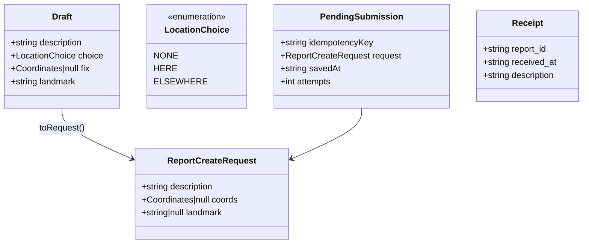
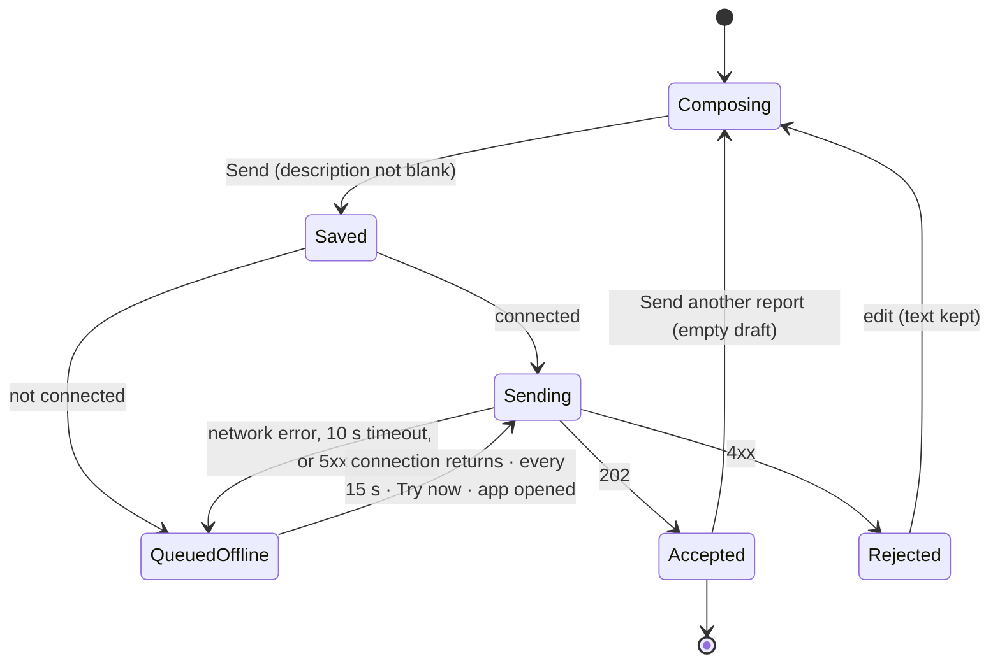
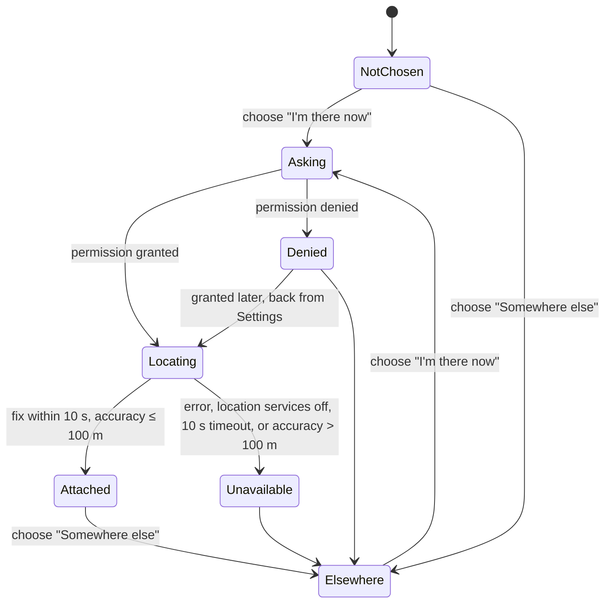
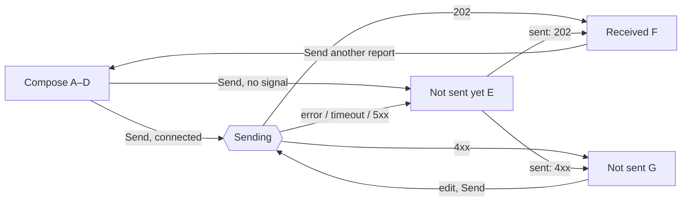
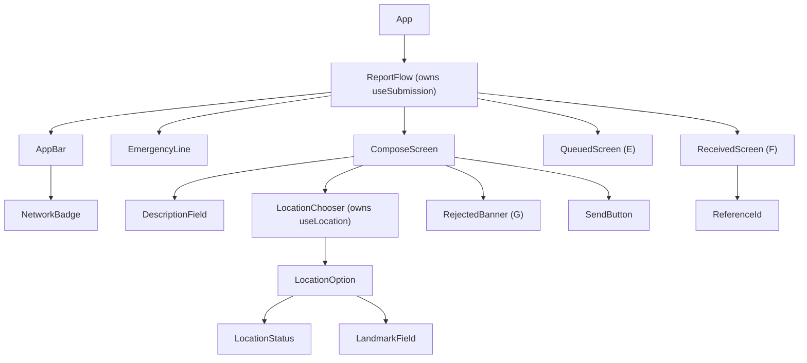

# Design — `reporter-app`

**Status:** `draft` · **Owner:** Katlego (Claude) · **Tasks:** `T008`; implementation tasks under
US1 · **Spec:** [SPEC.md](../../SPEC.md) `US1`, the reporter persona · **Domain model:**
[domain-model.md](domain-model.md)

---

## 1. What this covers

The resident reporter app in `apps/mobile` (Expo SDK 57.0.20, React Native 0.87.1, PLAN.md): one
flow that takes a description and an optional location, submits it to `POST /api/reports`, and
tells the reporter, truthfully, whether it arrived. It is built for bad signal: a report written
with no connection is saved on the phone and sent when the connection returns.

It does **not** cover: what happens to a report after `202` (ingest.md, triage.md), the responder
console (responder-console.md), reporter accounts or report history (none designed — §10), or
calling anyone. GridLock ranks reports; it does not dispatch (SPEC non-goals). The app keeps the
SAPS emergency line one tap away for exactly that reason.

## 2. Reference material

| Kind | Where |
| --- | --- |
| **Visual reference** | [`docs/design/assets/reporter-app.png`](assets/reporter-app.png) — 375 px frames **A** (compose, empty), **B** (location attached), **C** (permission denied), **D** (allowed, no fix), **E** (no signal: saved, not sent), **F** (received, with reference id), **G** (not accepted, text kept). Source: [`reporter-app.html`](assets/reporter-app.html); every measurement below is taken from it. |
| Design tokens | [`docs/design/assets/tokens.css`](assets/tokens.css) — the token set the console uses; consumed here through a generated module (§6.4) |
| API | [domain-model.md](domain-model.md) §6 `POST /api/reports`; [ingest.md](ingest.md) §6.2 `ReportCreateRequest` |
| Platform | Expo SDK 57 modules: `expo-location`, `@react-native-community/netinfo`, `@react-native-async-storage/async-storage`, `expo-clipboard`, React Native `Linking` |

**The app matches the reference in layout, tokens and copy.** Where this document and the image
disagree, one of them is a bug: stop and ask.

## 3. Domain model

**`toRequest(draft)`** — the one function that turns what the reporter entered into what is sent.
It is where Non-negotiable I is enforced at the client:

| `choice` | Permission / fix | `coords` | `landmark` |
| --- | --- | --- | --- |
| `NONE` (nothing selected) | — | `null` | `null` |
| `HERE` | granted, fix with accuracy ≤ 100 m | the fix | `null` |
| `HERE` | denied, or no usable fix (yet) | `null` | the inline field's text, or `null` if blank |
| `ELSEWHERE` | — (never asked) | `null` | the field's text, or `null` if blank |

- **No path produces a location the reporter didn't give.** No last-known position, no IP or
  network location, no reverse-geocoded suburb, no default. A report with no usable location is
  sent with both `null`, and the server marks it `UNKNOWN`.
- **`description` is sent verbatim** — no trim, no spell-correction. "Blank" (Send disabled) means
  it contains nothing but whitespace.
- **`category_hint` is never sent.** No screen collects it (§8).
- `landmark` is trimmed of surrounding whitespace only, and `null` when that leaves nothing; it is
  a place name, not evidence.

## 4. Flow and state

### 4.1 A submission

| State | Frame | Persisted on the phone |
| --- | --- | --- |
| `Composing` | A–D, and G's form | the draft text only, so a crash keeps what was typed |
| `Saved` | (instant) | the `PendingSubmission` — **written before the first attempt** |
| `Sending` | B's button reads `Sending…`, disabled | the `PendingSubmission` |
| `QueuedOffline` | E | the `PendingSubmission` |
| `Accepted` | F | nothing: the submission is deleted on `202` |
| `Rejected` | G | the draft text |

- **Saved first, then sent.** The `PendingSubmission` reaches AsyncStorage before the request
  leaves, so closing the app, losing power or a crash mid-request never loses a report.
- **One pending submission at a time.** While one is queued, the app shows E and nothing else (§8).
- **Retry.** `QueuedOffline` retries when NetInfo reports a connection, every 15 s while the app is
  in the foreground, on `Try now`, and each time the app is opened. It never gives up: a queued
  report stays until the server answers `202` or `4xx`. No exponential backoff — one phone sends one
  report.
- **Every attempt carries the same `Idempotency-Key`** header (the `PendingSubmission`'s UUID). It is
  what lets a retry after a lost response be recognised as the same report — see §10, which is
  where the server's half of this stands.
- **Timestamps.** `received_at` is set by the server when the request arrives (domain-model §3), so
  a report queued offline is timed by its arrival. E shows the phone's `Saved` time; F shows the
  server's `Received` time.

### 4.2 Location

| State | Frame | Inline under "I'm there now" | Sent |
| --- | --- | --- | --- |
| `NotChosen` | A | — (`You can send without a location.` under the options) | both `null` |
| `Asking`, `Locating` | B's layout | status `Finding your location…` | both `null` if sent now |
| `Attached` | B | green dot · `Your phone's location will be sent` | `coords` |
| `Denied` | C | warning · landmark field, focused | `landmark` or `null` |
| `Unavailable` | D | warning · landmark field | `landmark` or `null` |
| `Elsewhere` | — | landmark field inside "Somewhere else" | `landmark` or `null` |

- **The report never waits for a location.** Send stays enabled in every location state; pressing
  it while `Locating` sends without coordinates.
- Permission is requested **only when "I'm there now" is chosen**, foreground only
  (`requestForegroundPermissionsAsync`), never at launch.
- A fix is taken fresh after the choice (`getCurrentPositionAsync`, `Accuracy.Balanced`); a cached
  last-known position is never used.

## 5. Screens

On launch the app opens E if a `PendingSubmission` exists, otherwise A with any saved draft text.

## 6. Contracts

### 6.1 Produced — verbatim from domain-model §6

`POST /api/reports`

| Request body | Response |
| --- | --- |
| `{description: str (1..2000, non-blank), coords?: {lat, lon}, landmark?: str (≤200), category_hint?: str (≤100)}` | `202 {report_id: UUID, received_at: datetime}` · `422` on blank/oversize description |

The app sends `description` always, `coords` and `landmark` as `toRequest` (§3) gives them —
`null`, never omitted-by-accident — and `category_hint` never. Header: `Idempotency-Key: <uuid>`.
The ticket's "reference id" is `report_id`: the app shows the full UUID (frame F).

The base URL comes from `EXPO_PUBLIC_API_URL`. Request timeout: 10 s (the server's ack budget is
200 ms; the rest is the network the app is designed for).

### 6.2 Every rendered string

| Element | Text |
| --- | --- |
| Emergency line (every screen) | `In danger right now?` · button `Call SAPS 10111` → `Linking.openURL("tel:10111")` |
| Network badge (bar) | shown only when not connected: yellow dot · `No signal` |
| Heading | `What's happening?` |
| Description | label `Describe it` · placeholder `What you see, where, and whether anyone is hurt.` · counter `{n} / 2000` |
| Location | legend `Where is it?` · `I'm there now` / `Send my phone's location` · `Somewhere else` / `I'll name the street or place` · under the options when none is chosen: `You can send without a location.` |
| Locating | `Finding your location…` |
| Attached | `Your phone's location will be sent` |
| Denied | **`Location is off for GridLock.`** `Name the place below, or turn location on and try again.` · link `Open Settings` → `Linking.openSettings()` |
| Unavailable | **`Couldn't find your location.`** `Name the place below. Your report won't wait for a location.` |
| Landmark field | placeholder `Street, shop, school or landmark` (max 200) |
| Send | `Send report` · while sending `Sending…` |
| Queued (E) | heading `Not sent yet` · `Your phone has no signal. GridLock saved this report and sends it as soon as you're back online.` · the description in quotes · `Saved {HH:MM} · {location} · Trying again every 15 seconds` · below the panel `Keep GridLock open if you can. If you close it, it tries again the next time you open it.` · button `Try now` |
| `{location}` in E | `Phone location attached` · `Place: {landmark}` · `No location` |
| Received (F) | heading `Report received` · `Neighbourhood responders can see it now.` · `Received {HH:MM:SS}` · label `Reference` · the `report_id` · button `Copy` (then `Copied` for 2 s) · the description in quotes · below `GridLock ranks reports for responders. It doesn't call the police for you.` · button `Send another report` |
| Not accepted (G) | heading `Not sent` · `GridLock couldn't accept this report as it is. Your text is kept below. Check it and send again.` |

Clock times are the phone's local time, 24-hour. The description is shown exactly as typed.

### 6.3 Layout

375 px is the reference width; the layout is a single column at any phone width. App bar 52 px
(ink); the emergency line directly under it on every screen; content padding 16 px; the primary
action pinned to the bottom (`.foot`, 52 px button). Touch targets ≥ 44 px (`--gl-hit`). Text
respects the system font scale; the layout must still work at 200%.

### 6.4 Tokens and components

- **Tokens.** React Native cannot read CSS, so `apps/mobile/src/theme/tokens.ts` is **generated**
  from `docs/design/assets/tokens.css` by a script, and a test fails if it is stale — the same
  single-source rule as the contracts (T014). Never hand-edited.
- **Fonts.** The console's three families from `@expo-google-fonts/*`, pinned exactly, loaded with
  `expo-font` before the first screen renders.
- **Types.** `@gridlock/contracts` once `ReportCreateRequest` and the `202` response are generated
  there (§10). Until then the request type is declared once, in `api.ts`, from §6.1 verbatim.

## 7. Structure

| Path | New? | Responsibility |
| --- | --- | --- |
| `apps/mobile/src/request.ts` | new | `toRequest` (§3), pure |
| `apps/mobile/src/submission.ts` | new | the §4.1 state machine as a pure reducer |
| `apps/mobile/src/useSubmission.ts` | new | persistence, NetInfo, the retry timer, the request |
| `apps/mobile/src/useLocation.ts` | new | the §4.2 machine over `expo-location` |
| `apps/mobile/src/api.ts` | new | `POST /api/reports` with the timeout and `Idempotency-Key` |
| `apps/mobile/src/theme/tokens.ts` | new, generated | from `tokens.css` |
| `apps/mobile/src/components/*.tsx` | new | one file per component above |

## 8. Decisions & alternatives

| Decision | Chosen | Rejected, and why |
| --- | --- | --- |
| Device GPS | Sent only after "I'm there now" (domain-model §10) | GPS by default: someone reporting what they saw on the way home attaches an `EXACT` location that is wrong — an invented location with the highest confidence label. |
| Fix accuracy | ≤ 100 m, else `Unavailable` | Any fix: a 2 km cell-tower fix labelled `EXACT` places a report in the wrong suburb. 100 m keeps a fix inside its H3 cell or a neighbour (~350 m apart). |
| Waiting for a fix | Never: Send stays enabled | Holding Send until a fix: a report about a break-in waits on a GPS chip. |
| Category | Not collected | A preset category list: an invented taxonomy that biases triage; the text already says what happened. |
| Saving | Before the first attempt | After a failure: a crash mid-request loses the report. |
| Retry | Forever, every 15 s plus on reconnect | Giving up after N attempts: a safety report silently dropped. Exponential backoff: a phone back on signal waits minutes. |
| Concurrent reports | One pending at a time | A queue of several: unsent reports pile up out of sight, and a second report about the same thing becomes a duplicate. |
| 5xx | Queue and retry | Treat as rejected: the server's problem would land on the reporter as "not accepted". |
| Emergency line | On every screen | Only on errors: the person most in need of it is on the compose screen. |

Deviations from [docs/architecture-defaults.md](../architecture-defaults.md): none beyond PLAN.md's
recorded one (a second client surface).

## 9. How this is verified

1. **`toRequest`** — every row of the §3 table, plus: whitespace-only description is not sendable;
   a description with leading spaces is sent with them; a fix with accuracy 101 m yields
   `coords: null`; no input ever yields a `landmark` the reporter didn't type.
2. **Submission reducer** — every transition in §4.1, and none that isn't drawn; `Saved` persists
   before the request is made (assert storage write order); the same `Idempotency-Key` on every
   attempt; `202` deletes the pending submission; `4xx` keeps the text; `5xx`, timeout and network
   error all queue.
3. **Location** — every transition in §4.2 with `expo-location` mocked; permission is never
   requested at launch; `getLastKnownPositionAsync` is never called.
4. **Screens** (`jest-expo` + React Native Testing Library) — frames A–G rendered from fixtures,
   asserting every string in §6.2 that the frame shows.
5. **Visual comparison against §2's reference** — the app at 375 × 812 on a simulator for each
   frame, screenshots next to A–G in the PR, signed off for layout, tokens and copy.

## 10. Open questions

- [ ] **Duplicate reports from retries — needs the ingest lane.** When a send times out after the
      request reached the server, the phone cannot know it arrived, and the retry creates a second
      report. The verifier then links the two as `2 reports`: an **invented corroboration**,
      exactly what Non-negotiable I forbids. The app already sends one `Idempotency-Key` per
      report; `POST /api/reports` must honour it (same key → same `report_id`, no second row) —
      a change to domain-model §6 and ingest.md, owned by the ingest lane. Until it lands, every
      ambiguous retry can duplicate.
- [ ] **`ReportCreateRequest` in `@gridlock/contracts`.** It lives in ingest.md §6.2 today, so the app
      declares the request type itself (§6.4). Moving it into `packages/contracts` makes T014 generate
      it for both clients.
- [ ] **Report history and status.** A reporter has their reference id but nothing to look it up
      with: `GET /api/reports/{id}` returns responder data. Undrawn and undesigned.
- [ ] **Languages.** English only, like triage (SPEC non-goals). The copy table in §6.2 is the
      string list a translation would start from.
