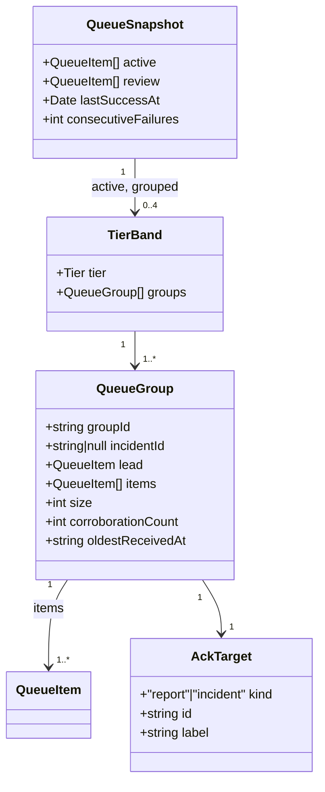
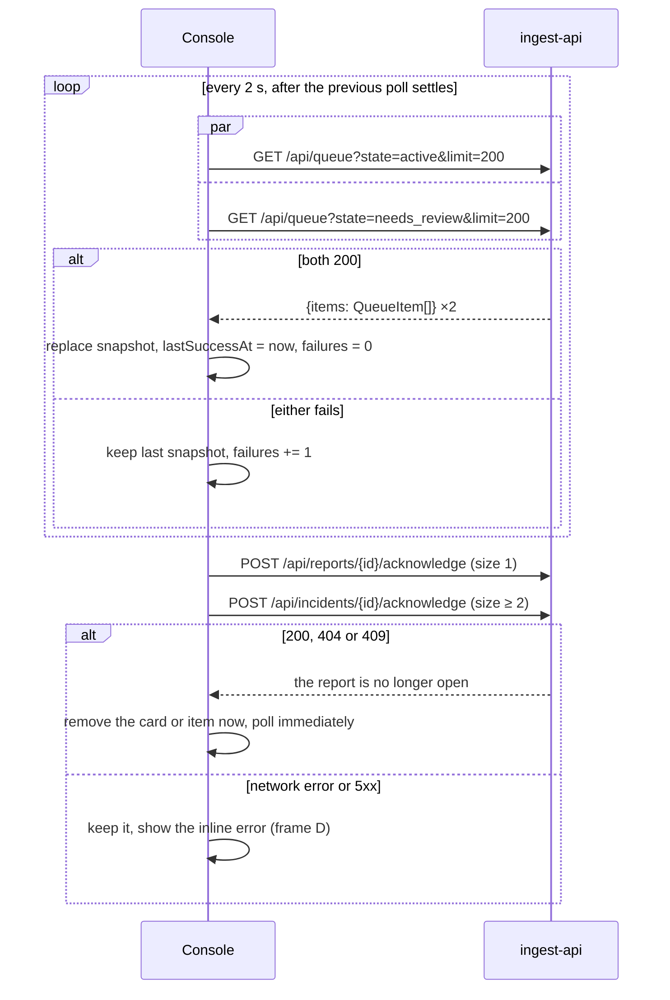
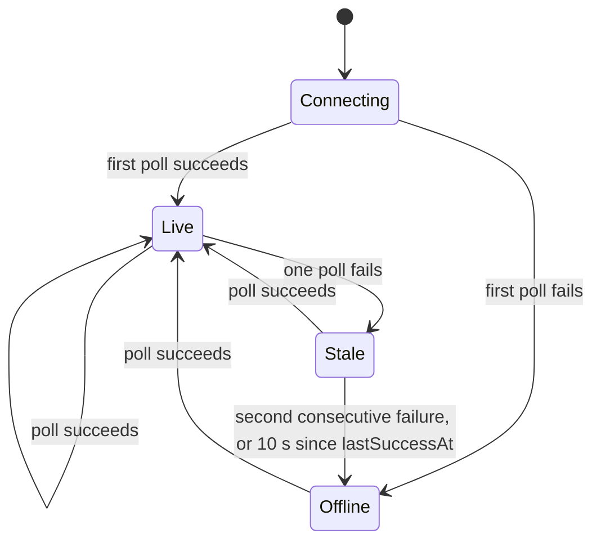
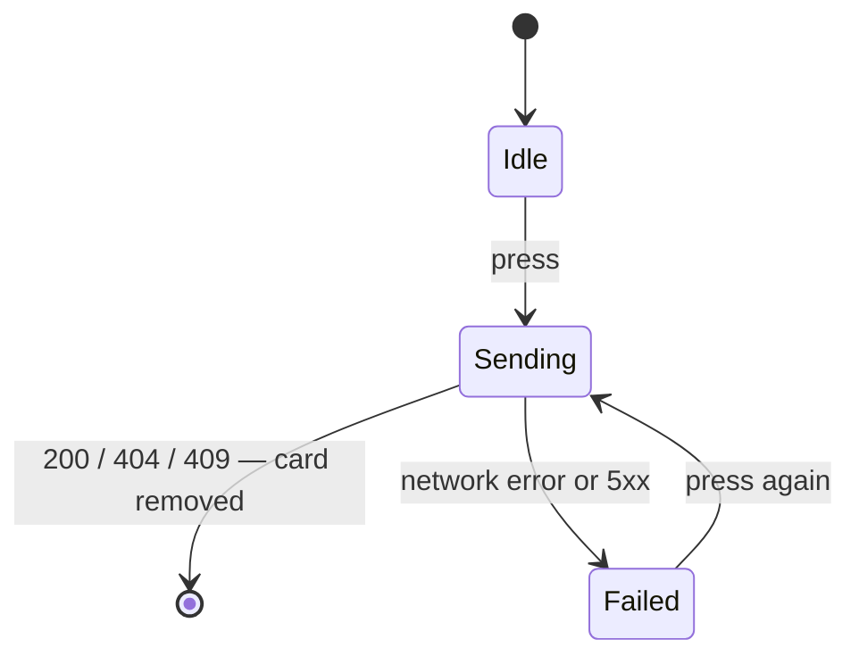
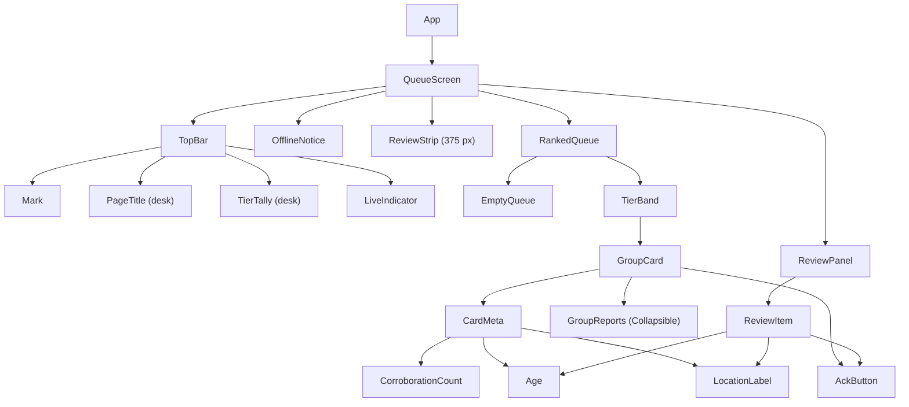

# Design — `responder-console`

**Status:** `draft` · **Owner:** Katlego (Claude) — specifies; Kamo builds `apps/web` ·
**Tasks:** `T006`; implementation tasks under US5 · **Spec:** [SPEC.md](../../SPEC.md) `US5` ·
**Domain model:** [domain-model.md](domain-model.md)

---

## 1. What this covers

The responder console in `apps/web`: one screen that polls the queue, shows open reports ranked by
tier with a distinct, always-visible **Needs review** group, and lets a responder acknowledge a
report or a whole incident. It renders what `ingest-api` returns and decides nothing about rank,
grouping or location itself.

It does **not** cover: the queue's ordering and grouping (server-side, [ingest.md](ingest.md) §6.3),
the reporter app ([reporter-app.md](reporter-app.md), T008), report detail, re-run or resolve
(§10 — none is drawn, so none is built).

## 2. Reference material

| Kind | Where |
| --- | --- |
| **Visual reference** | [`docs/design/assets/responder-queue.png`](assets/responder-queue.png) — frames **A** (desk, populated), **B** (375 px, populated), **C** (desk, empty), **D** (desk, connection lost + failed acknowledge), **E** (375 px, Needs review shown), **F** (375 px, empty). Source: [`responder-queue.html`](assets/responder-queue.html). Every class name and measurement below is taken from that source. |
| Design tokens | [`docs/design/assets/tokens.css`](assets/tokens.css) — the one token set; `apps/web` imports it from there, never a copy (already true in `apps/web/src/main.tsx`) |
| Existing code this must match | `apps/web/src/App.tsx` (top bar), `apps/web/src/Mark.tsx` (the mark) — keep both |
| Types | `@gridlock/contracts` (`packages/contracts/ts`, T014) — `QueueItem`, `Tier`, `ReportState`, `LocationConfidence`. Imported, never re-declared |
| API | [domain-model.md](domain-model.md) §6, [ingest.md](ingest.md) §6 |
| Failure reasons | [triage.md](triage.md) §6.4 — the closed set of `failure_reason` values |

**The screen matches the reference in layout, tokens and copy** (US5). Where this document and the
image disagree, one of them is a bug: stop and ask, don't pick.

## 3. Domain model

The console's view model. Everything here is **derived** from `QueueItem[]` on each poll; nothing
is stored server-side or invented client-side.



**Derivation rules** (one pure function each, unit-tested — §9):

- **Grouping.** Walk `active` **in response order**. `groupKey = incident_id ?? report_id`. Each run
  of consecutive items with the same key is one `QueueGroup`. The server already returns an
  incident's reports next to each other (domain-model §6, "Queue grouping"); the console **never
  sorts**.
- **Lead.** `lead = items[0]`. The card shows the lead's `tier` and `reason`.
- **Bands.** Consecutive groups with the same `lead.tier` form one `TierBand`. Because the server
  ranks highest tier first, bands come out in the order CRITICAL_DISPATCH, URGENT, ADVISORY,
  MONITOR. A tier with no groups has no band.
- **`size`** = `items.length` — the reports in this group that are **open in this response**.
- **`corroborationCount`** = `lead.corroboration_count` — every report linked to the incident,
  including ones already acknowledged. So `corroborationCount ≥ size`, and they differ once some of
  an incident's reports are acknowledged one by one. The count label shows corroboration (evidence);
  the expander and the acknowledge button show `size` (what's still here to act on).
- **`oldestReceivedAt`** = the earliest `received_at` among `items`.
- **Contract violations fail loudly.** An `active` item with `tier === null` cannot exist (the
  database refuses `TRIAGED` without a tier, `0001_init.sql`). If one arrives, the response is
  rejected as a whole and counts as a failed poll (§5) — never rendered as a guess, never dropped
  silently.

## 4. Flow



- **Polling.** Both requests together; the next poll starts **2 s after both settle** — never
  overlapping. 2 s keeps "submit → visible ≤ 5 s" (ingest.md budget) with triage's 3 s p95.
- **`limit=200`**, the maximum: a report cut off the bottom of the queue is a report nobody sees.
  What happens beyond 200 groups is open (§10).
- **Snapshot replacement is atomic.** Both lists from one poll replace the old ones together, so the
  tally, bands and Needs-review count never mix two polls.
- **Acknowledge** is not optimistic: the card stays until the server answers. `200`, `404` and `409`
  all mean "this is not open any more" (acknowledged here, gone, or acknowledged by someone else),
  so all three remove it; the immediate poll then reconciles. Only a request that never got an
  answer, or a `5xx`, keeps the card.
- **API origin.** Requests go to the same origin under `/api`. In development, Vite proxies `/api`
  to `VITE_API_TARGET` (default `http://localhost:8000`). No auth header — none is designed (§10).

## 5. State

**Connection** — drives the live indicator and the offline notice.



| State | Bar (desk) | Bar (375 px) | Body |
| --- | --- | --- | --- |
| Connecting | no live indicator, clock only | clock only | empty: no spinner, no skeleton |
| Live, Stale | green dot · `Live · updated {n} ago` | green dot · `Live` | the snapshot |
| Offline | red dot · **`Offline`** `· last updated {n} ago` (frame D) | red dot · **`Offline`** | offline notice above the snapshot (frame D) |

`Stale` looks exactly like `Live`; the growing "updated {n} ago" is the signal. `Offline` before any
success has no snapshot: the body is the notice alone, with its own copy (§6.3).

**Acknowledge button** — one per card and per review item.



`Sending`: button disabled, `aria-busy="true"`, label unchanged. `Failed`: inline error under the
card (frame D, `.ackerr`, `role="alert"`), button enabled. The error clears on the next press.

**Expander** (`QueueGroup` with `size ≥ 2`): `Collapsed ⇄ Expanded`, collapsed by default. Kept per
`groupId` across polls; forgotten when the group leaves the response.

**Needs review on 375 px** (frame B ⇄ E): `Hidden ⇄ Shown`, hidden by default, toggled by the strip's
button.

## 6. Contracts

### 6.1 Consumed — verbatim from domain-model §6

```ts
// from "@gridlock/contracts" — generated from packages/contracts (T014); never re-declared
export interface QueueItem {
  report_id: string;
  incident_id: string | null;
  tier: Tier | null;
  reason: string | null;
  corroboration_count: number;
  grid_cell: string | null;
  location_confidence: LocationConfidence;
  state: ReportState;
  received_at: string;
  description: string;
  failure_reason: string | null;
}
```

| Call | Response used |
| --- | --- |
| `GET /api/queue?state=active&limit=200` | `200 {items: QueueItem[]}` — open `TRIAGED` reports, grouped and ranked |
| `GET /api/queue?state=needs_review&limit=200` | `200 {items: QueueItem[]}` — `NEEDS_REVIEW`, plus `RECEIVED` older than 5 s, oldest first |
| `POST /api/reports/{report_id}/acknowledge` | `200` / `404` / `409` → removed (§4) |
| `POST /api/incidents/{incident_id}/acknowledge` | `200` / `404` / `409` → removed (§4) |

### 6.2 Layout

- **Breakpoint 1024 px.** At ≥ 1024 px, the desk layout (frames A, C, D): `.desk-body` grid
  `1fr 420px`, gap 24, padding `24px 28px 28px`; the ranked list left, Needs review right. Below
  1024 px, the 375 px layout (frames B, E, F), single column.
- **Desk.** Bar 60 px: mark, `Responder queue`, tally, live indicator pushed right. Bands are
  `.band`: a 44 px tier spine (`--gl-rail`) with the tier name vertical and the band's card count at
  the bottom; cards stacked in `.cards`. Needs review is the `aside.review` with the hatch on top.
- **375 px.** Bar 52 px: mark and live indicator only — no page title, no tally. Under it the
  Needs-review **strip** (hatch, count, `Show`/`Hide`), then, when shown, the review items (frame E),
  then the bands as `.hband`: a horizontal tier header with name and count. Card actions go full
  width; the expander sits above the button (frame B).
- **The Needs-review group is always visible without scrolling past the ranked list** (US5): beside
  it on desk, above it on 375 px.

### 6.3 Every rendered string

| Element | Rule | Source |
| --- | --- | --- |
| Page title (desk) | `Responder queue` | — |
| Tally chip | `CRIT` `URG` `ADV` `MON` + the band's card count; a chip only for a band that exists; no tally when `active` is empty | bands |
| Live indicator (desk) | `Live · updated {elapsed} ago` / `Offline · last updated {elapsed} ago`, then `HH:MM` now | `lastSuccessAt` |
| Spine / band header | `Critical dispatch` · `Urgent` · `Advisory` · `Monitor`, and the band's card count | `lead.tier` |
| Card headline | `lead.reason`, as sent | `reason` |
| Dots | `min(corroborationCount, 3)` dots in the tier colour, `aria-hidden` | `corroboration_count` |
| Count | `1 report` · `{n} reports`, n = `corroborationCount` | `corroboration_count` |
| Age | `{age}` then the clock time of `oldestReceivedAt` as `HH:MM` | `received_at` |
| Location (desk) | `EXACT` → `Phone GPS · {grid_cell}` · `RESOLVED` → `Matched a landmark · {grid_cell}` · `AMBIGUOUS` → `Ambiguous: matched more than one place` · `UNKNOWN` → *`Location unknown`* (italic) | `location_confidence`, `grid_cell` |
| Location (375 px) | the same, without `· {grid_cell}` | 〃 |
| Location, untriaged | review item with `state = RECEIVED` → *`Location not checked yet`* (italic) | `state` |
| Expander (`size ≥ 2`) | `▸ Show the {size} reports` / `▾ Hide the {size} reports` | `size` |
| Expanded rows | per item, in response order: `HH:MM` of `received_at`, then `description` in curly quotes | `items` |
| Expanded footnote | `Grouped because they were sent from the same or a neighbouring cell (about 350 m), each within 15 minutes of the last.` | verification.md §4 |
| Acknowledge | `size` 1 → `Acknowledge` · 2 → `Acknowledge both` · ≥ 3 → `Acknowledge all {size}` | `size` |
| Review header (desk) | `Needs review {n}`; when n ≥ 1, `Not ranked. GridLock couldn't assign a tier, so read these yourself.` | `review.length` |
| Review empty (desk) | `Nothing is waiting for review.` | — |
| Strip (375 px) | n ≥ 2 → `{n} need review` · n = 1 → `1 needs review`, each with `Not ranked · oldest {age}` and a `Show`/`Hide` button · n = 0 → `Nothing needs review`, no sub-line, no button (frame F) | `review` |
| Review headline | `state = RECEIVED` → `Waiting for triage` · `model timed out` → `Couldn't rank: the triage model timed out` · starts `model error: ` → `Couldn't rank: the triage model failed` · starts `invalid model output: ` → `Couldn't rank: the model's answer wasn't one of the four tiers` · anything else → `Couldn't rank: {failure_reason}` verbatim | `failure_reason`, triage.md §6.4 |
| Review age | `{age}` of the item's `received_at`, right-aligned, no clock time | `received_at` |
| Review quote | `description` in curly quotes | `description` |
| Empty queue | `No open reports` / `New reports appear here, ranked by tier, within 5 seconds of being sent. Reports you acknowledge leave this list.` / `Last checked {HH:MM:SS}` | `lastSuccessAt` |
| Offline notice | **`Can't reach GridLock.`** `This list is from {HH:MM:SS} and may be out of date. Reports sent since then are not shown. Retrying every 2 seconds.` | `lastSuccessAt` |
| Offline notice, nothing loaded yet | **`Can't reach GridLock.`** `No reports have loaded yet. Retrying every 2 seconds.` | — |
| Acknowledge failed | network error → `Not acknowledged: GridLock couldn't be reached. Try again.` · `5xx` → `Not acknowledged: GridLock returned an error. Try again.` | response |

**Formats.**
- `{age}` and `{elapsed}`, floored: under 60 s → `{s} s`; under 60 min → `{m} min`; otherwise
  `{h} h {m} min`, or `{h} h` when m = 0. Recomputed every second.
- Clock times are the browser's local time, 24-hour, zero-padded (`HH:MM`, `HH:MM:SS`).
- `description` and `reason` are shown as sent: no trimming, no truncation (`white-space: pre-wrap`).

**Emphasis.** The acknowledge button is filled (`.ack.primary`) in the CRITICAL_DISPATCH band and
outlined (`.ack`) everywhere else, Needs review included.

### 6.4 Tokens and components

- **Tokens.** `docs/design/assets/tokens.css` stays the single source, imported by `apps/web`
  directly. Tailwind reads it through `@theme inline` (`--color-tier-critical: var(--gl-tier-critical)`
  and so on): no colour, size or font is typed into a component. How `apps/mobile` consumes it is
  decided in reporter-app.md (T008).
- **Fonts.** Atkinson Hyperlegible 400/700, Barlow Condensed 500/600/700, IBM Plex Mono 400/500,
  self-hosted from `@fontsource` packages pinned to exact versions. A responder's network shouldn't
  decide whether the screen is legible.
- **shadcn/ui.** `Button` (CVA variants `primary` and `outline`, matching `.ack.primary` and `.ack`)
  and `Collapsible` (Radix) for the expander and the 375 px strip. Restyled with the tokens; the
  stock theme is not used.
- **Accessibility.** Every target is ≥ 44 px (`--gl-hit`). Visible focus: `3px solid --gl-focus`,
  offset 2 px. Tier is never colour alone: the band name is text. Each band is a `section` with its
  tier name as an `h2`. Each card is an `article` labelled by its headline, and its button is
  described by it (`aria-describedby`). The offline notice is `role="status"`, an acknowledge error
  `role="alert"`. There is no motion, so reduced motion needs nothing.

## 7. Structure

Component tree — one component per box. Derivations live in `queue.ts` as pure functions, never
inside components.



- `QueueScreen` owns the poll (`usePolledQueue`) and the connection state; nothing below it fetches.
  `AckButton` posts and reports the outcome up.
- `ReviewPanel` is the desk aside. On 375 px its header is hidden and its items render under
  `ReviewStrip` when shown.
- `queue.ts` exports: `groupQueue`, `ackTarget`, `formatAge`, `formatClock`, `locationLabel`,
  `reviewHeadline`, `stripLabel`.

| Path | New? | Responsibility |
| --- | --- | --- |
| `apps/web/src/queue.ts` | new | the derivation rules of §3 and §6.3, pure |
| `apps/web/src/usePolledQueue.ts` | new | the §4 poll loop and the §5 connection states |
| `apps/web/src/components/*.tsx` | new | one file per component above |
| `apps/web/src/App.tsx`, `Mark.tsx` | changed | the bar grows the tally and live indicator |
| `apps/web/package.json`, root `package.json` | changed | `apps/web` joins the npm workspace to import `@gridlock/contracts` |

## 8. Decisions & alternatives

| Decision | Chosen | Rejected, and why |
| --- | --- | --- |
| Who orders the queue | The server; the console renders response order | Re-sorting on the client: two implementations of one ranking rule are how the console and the API disagree about what's urgent. |
| Count vs. size | Count label = `corroboration_count`; expander and button = open reports in the group | One number for both: either understates the evidence, or offers "Acknowledge all 3" when only 2 are left. |
| Acknowledge | Remove on the server's answer; `404`/`409` remove too | Optimistic removal: a failed acknowledge would make a dispatch-worthy report vanish from the screen while still open. |
| Live updates | 2 s polling, no overlap | WebSockets: out of scope for the MVP (SPEC non-goals). Polling slower than 2 s breaks the 5 s budget. |
| Ambiguous location copy | `Ambiguous: matched more than one place` | `matched 2 places` (the first reference): `QueueItem` carries no count of matched places, so the number would be invented. The reference was changed to match. |
| Dots | Capped at 3 | One per report: 12 dots would push the meta row onto two lines; the number beside them is the count. |
| Failure headlines | Closed mapping from triage.md §6.4, raw text as fallback | Showing `failure_reason` raw everywhere: `invalid model output: {…}` is evidence, not a headline. Hiding unknown reasons: a new failure kind would vanish. |
| Fonts | Self-hosted `@fontsource` | Google Fonts at runtime: a blocked CDN changes the screen's legibility, and the reference's whole type system with it. |

Deviations from [docs/architecture-defaults.md](../architecture-defaults.md): none.

## 9. How this is verified

1. **Derivations** (`queue.test.ts`): `groupQueue` keeps response order at every tie that ingest.md
   §6.3 ranks by (tier, corroboration, age, group id), forms one group per consecutive
   incident run, and turns a lone item with an `incident_id` into a group of one. `ackTarget` gives
   `report`/`incident` and the three labels. `formatAge` at 59 s, 60 s, 59 min, 60 min and 1 h 12 min.
   `locationLabel` for all four confidences plus `RECEIVED`. `reviewHeadline` for every triage.md §6.4
   value and an unknown one.
2. **Frames** (`QueueScreen.test.tsx`): fixtures that reproduce frames A–F item for item, with the
   clock frozen at the frame's time; each asserts every string in §6.3 that the frame shows.
3. **Poll and acknowledge** (`usePolledQueue.test.ts`, fake timers + mocked `fetch`): no overlapping
   polls; Live → Stale → Offline after two failures and after 10 s; Offline → Live; acknowledge
   `200`/`404`/`409` removes and re-polls; a network error and a `503` keep the card and show the
   right error.
4. **Visual comparison against §2's reference**: Playwright screenshots at 1440 × 900 and 375 × 812
   of the fixture states, put next to frames A–F in the PR. The reviewer signs off on layout, tokens
   and copy.

## 10. Open questions

- [ ] **More than 200 groups.** `limit` maxes at 200 and nothing says the list was cut. Decide before
      a deployment with real volume: a "showing the top 200" line, or paging.
- [ ] **Report detail.** `GET /api/reports/{id}` exists, but no frame shows a detail view (evidence,
      model, prompt version). Draw it before building it.
- [ ] **Resolve and re-run.** `ACKNOWLEDGED → RESOLVED` and `NEEDS_REVIEW → TRIAGED` have no
      endpoint (domain-model §10). Acknowledged reports leave this screen, and nothing shows them yet.
- [ ] **Responder sign-in.** SPEC names no responder authentication, so anyone who can reach the
      console can acknowledge. Decide before the console leaves a trusted network.
