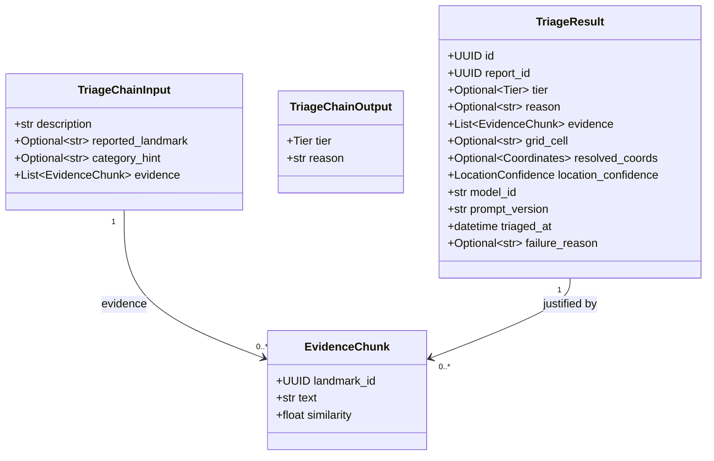
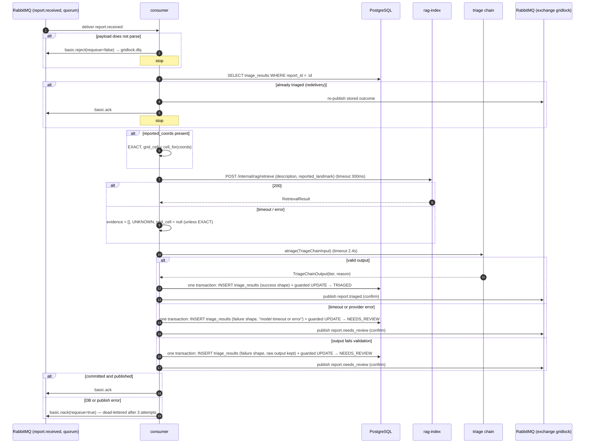
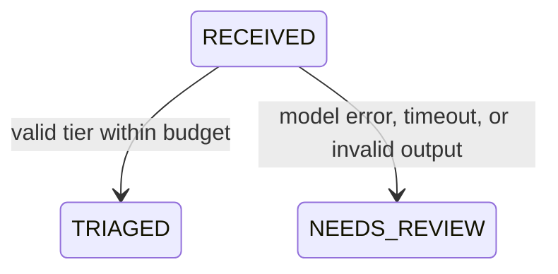

# Design — `triage-engine`

**Status:** `agreed` (Katlego, 2026-09-29) · **Owner:** Katlego (Gemini; revised by Claude) ·
**Tasks:** `T003` · **Spec:** `US2`, `US6` · **Domain model:** [domain-model.md](domain-model.md)

---

## 1. What this covers

`triage-engine` consumes `report.received`, gets landmark evidence from `rag-index`, runs a portable
LangChain chain that assigns exactly one of four tiers with a one-sentence reason, validates the
result without coercion, persists a `TriageResult`, and publishes `report.triaged` or
`report.needs_review`.

It does **not** cover ingestion (`ingest.md`), embedding and the RESOLVED/AMBIGUOUS/UNKNOWN rule
(`rag.md`), or corroboration (`verification.md`).

---

## 2. Reference material

| Kind | Where |
| --- | --- |
| Shared domain model | [domain-model.md](domain-model.md) §3 (`TriageResult` and its two shapes), §4 (failure table), §5 (lifecycle), §6 (AMQP, `RetrievalResult`, delivery semantics) |
| User stories | `US2` (tier + reason), `US6` (portability) |
| Governing rules | Never invent a tier or a location; a failure degrades to `NEEDS_REVIEW`, never to a guess; `tier`, `reason`, `evidence`, `model_id`, `prompt_version` are persisted together. Budget: consumed → persisted ≤ 3s p95. |
| Retrieval contract | [rag.md](rag.md) §7 |

---

## 3. Domain model

`TriageResult`, `EvidenceChunk`, `Coordinates` and `RetrievalResult` are exactly as in domain-model
§3/§6. The chain's own input and output types are below — the class diagram and §6.1 describe the
same two classes.



### Invariants

1. **Four tiers, no coercion.** The chain's output is parsed into `TriageChainOutput`. Anything that
   does not parse — an unknown tier (`"HIGH"`, `"URGENT!"`), missing fields, non-JSON — is a
   failure: `TriageResult(tier=null, reason=null, failure_reason="invalid model output: <raw>")`,
   `Report.state = NEEDS_REVIEW`.
2. **Grounded reason.** One non-empty sentence citing or paraphrasing only the description and the
   evidence. The chain cannot enforce this; the grounding test in §9 checks it.
3. **Location is decided by rules, never by the model.** The model sees evidence but its output has
   no location field:
   - `reported_coords` present → `EXACT`, `grid_cell = cell_for(coords)`, `resolved_coords = coords`.
     Retrieval still runs, for evidence only; it cannot override GPS.
   - otherwise → `location_confidence`, `grid_cell` and `resolved_coords` are copied verbatim from
     `rag-index`'s `RetrievalResult`.
   - `rag-index` unreachable or slow → `UNKNOWN`, `grid_cell = null`, `evidence = []`.
4. **Budget.** Consumed → persisted ≤ 3s p95: retrieval timeout 300ms, model timeout 2.4s, leaving
   ~300ms for persistence and publishing.
5. **Idempotent on `report_id`.** If a `TriageResult` already exists for the report, the stored
   outcome is re-published and the message acked — no second model call, no second row.
6. **Guarded state change.** `UPDATE reports SET state = :new WHERE id = :id AND state = 'RECEIVED'`.
   If a responder acknowledged the report first, the result is still stored and the state stays
   `ACKNOWLEDGED`.

---

## 4. Flow



The order *commit → publish → ack* is what makes a crash safe without a second outbox: a crash
before the ack means redelivery, and redelivery hits the idempotency branch, which re-publishes.

### Failure matrix

| Failure | Detection | Action | Result |
| --- | --- | --- | --- |
| `rag-index` down or > 300ms | HTTP error / timeout | `evidence = []`, `UNKNOWN` (or `EXACT` if GPS) | Tier from text alone; the reason must not name a place |
| Model error or > 2.4s | provider exception / `asyncio.TimeoutError` | Failure-shape result, `NEEDS_REVIEW`, ack | Visible in `Needs review` at once; no retry storm |
| Invalid model output | parse/validation error | Failure-shape result with the raw output, `NEEDS_REVIEW`, ack | Zero invented tiers |
| DB down | driver error | `nack(requeue=true)`; dead-lettered after 3 attempts | Page-worthy: a report is invisible while in the DLQ |
| Malformed message | payload does not parse | `reject(requeue=false)` → DLQ | Poison message isolated |
| Duplicate delivery | existing `TriageResult` | Re-publish stored outcome, ack | One row, one model call |

---

## 5. State

The `Report` transitions this service performs (domain-model §5 is the full machine):



`NEEDS_REVIEW → TRIAGED` (manual re-run) is drawn in the domain model but has no trigger yet
(domain-model §10); this service does not perform it.

---

## 6. Contracts

### 6.1 The chain (US6)

`chain.py` imports only LangChain, Pydantic, the standard library and `gridlock_contracts`. No
`fastapi`, `starlette`, `sqlalchemy`, `aio_pika` or `psycopg` may appear in its import graph.

```python
# services/triage-engine/src/gridlock_triage/chain.py
from typing import Protocol
from pydantic import BaseModel, Field
from gridlock_contracts.enums import Tier
from gridlock_contracts.models import EvidenceChunk

class TriageChainInput(BaseModel):
    description: str = Field(..., min_length=1, max_length=2000)
    reported_landmark: str | None = None
    category_hint: str | None = None
    evidence: list[EvidenceChunk] = []

class TriageChainOutput(BaseModel):
    tier: Tier
    reason: str = Field(..., min_length=5, max_length=500)

class TriageChain(Protocol):
    model_id: str        # the exact model identifier sent to the provider; persisted as-is
    prompt_version: str  # §6.2

    async def atriage(self, data: TriageChainInput) -> TriageChainOutput:
        """Raises InvalidModelOutput(raw: str) when the output does not parse."""
        ...
```

Evidence reaches the prompt as one line per chunk — `- {text} (similarity {similarity:.2f})` — or
the literal `none` when the list is empty. Formatting happens inside the chain.

### 6.2 Prompt file and `prompt_version`

- **File:** `services/triage-engine/prompts/triage_v1.prompt`, a LangChain f-string template.
- **`prompt_version`:** `"<file stem>:<first 12 hex chars of SHA-256 of the file's raw bytes>"`, e.g.
  `triage_v1:3f09a1c2b7de`. Raw bytes, no normalisation — any change, including whitespace, is a new
  version. `.gitattributes` pins the file to LF so the hash is the same on every clone.
- Loaded once at startup.

The template (the JSON braces are doubled because the file is an f-string template; single braces
would make LangChain raise `KeyError` on the first call):

```text
You are the GridLock triage engine for community-safety reports in South Africa.
Assign EXACTLY ONE tier using the rules below, in order. The first rule that matches decides.

1. CRITICAL_DISPATCH — a threat to someone's life or body is happening now:
   - forced entry into a home is in progress (a home invasion), whether or not the report says
     anyone is inside — unless the report says the home is empty;
   - a weapon is present at a crime in progress;
   - someone is being assaulted, abducted or held now;
   - a fire or other hazard is trapping people now.
2. URGENT — a crime is in progress or has just happened, and rule 1 does not apply:
   - a break-in in progress at a home the report says is empty, or at a non-residential property;
   - suspects are on or at the property now, without a weapon mentioned;
   - a violent crime happened and the suspects are still nearby.
3. ADVISORY — no one is in danger now:
   - a crime discovered after the fact (a car broken into overnight, a house found burgled);
   - suspicious activity with no crime described (a car idling for hours, someone watching houses);
   - a physical hazard with no one trapped (an open manhole, exposed electrical wiring).
4. MONITOR — a nuisance or municipal matter: noise, streetlights, dumping, potholes, leaks, stray
   animals.

Never add a weapon, a victim, a suspect or a place that the report and the evidence do not
contain. If the report is too vague to apply a rule, choose the lowest tier the text supports.

Report: {description}
Landmark the reporter named: {reported_landmark}
Category hint: {category_hint}
Landmark evidence:
{evidence}

Reply with JSON only, exactly this shape, and a one-sentence reason quoting the report's own words:
{{"tier": "CRITICAL_DISPATCH" | "URGENT" | "ADVISORY" | "MONITOR", "reason": "<one sentence>"}}
```

### 6.3 Tier criteria

The prompt above **is** the criteria. There is deliberately no second table here that could drift
from it. Worked examples, which become test cases (§9):

| Report | Tier | Rule |
| --- | --- | --- |
| "men with a gun forcing my back door, I'm inside with my kids" | `CRITICAL_DISPATCH` | 1 (forced entry, home, weapon) |
| "men breaking through my back gate, 14 Sisulu Street" | `CRITICAL_DISPATCH` | 1 (forced entry into a home in progress; occupancy not stated) |
| "someone is breaking into the empty house next door, owners are overseas" | `URGENT` | 2 (home stated empty) |
| "guys climbing into the spaza shop roof right now" | `URGENT` | 2 (non-residential, in progress) |
| "my car window was smashed overnight, radio gone" | `ADVISORY` | 3 (after the fact) |
| "streetlight out on the corner since Tuesday" | `MONITOR` | 4 |

---

## 7. Structure

| Path | New? | Responsibility |
| --- | --- | --- |
| `services/triage-engine/pyproject.toml` | new | Pinned deps: LangChain, pydantic, aio-pika, psycopg, httpx, `gridlock-contracts` |
| `services/triage-engine/prompts/triage_v1.prompt` | new | The template in §6.2 |
| `services/triage-engine/src/gridlock_triage/chain.py` | new | The chain; transport- and storage-free |
| `services/triage-engine/src/gridlock_triage/prompt_loader.py` | new | Loads the template, computes `prompt_version` |
| `services/triage-engine/src/gridlock_triage/rag_client.py` | new | `POST /internal/rag/retrieve` with the 300ms timeout |
| `services/triage-engine/src/gridlock_triage/repository.py` | new | Idempotency lookup, result insert, guarded state update |
| `services/triage-engine/src/gridlock_triage/consumer.py` | new | The §4 flow |
| `services/triage-engine/tests/test_chain_isolation.py` | new | US6 import-graph test |
| `services/triage-engine/tests/test_chain_logic.py` | new | Prompt formatting, parsing, rejection, worked examples |
| `services/triage-engine/tests/test_consumer.py` | new | Failure paths, idempotency, DLQ |

---

## 8. Decisions and alternatives

| Decision | Chosen | Rejected, and why |
| --- | --- | --- |
| Portability boundary | LangChain runnables behind a `TriageChain` protocol | Calling a provider SDK directly — the Python-now/Java-later portability is the reason LangChain is in the stack. |
| Invalid tier | Reject to `NEEDS_REVIEW` | Mapping `"HIGH"` to `URGENT` invents a decision nobody made. |
| Home break-in, occupancy unstated | `CRITICAL_DISPATCH` | `URGENT` until occupancy is confirmed: occupancy is almost never stated in a panicked report, so this would rank most real home invasions below dispatch — the exact failure GridLock exists to prevent. Only an explicit "empty" lowers it. |
| One source of criteria | The prompt file | A criteria table beside the prompt: two lists drift, and the model only ever reads one of them. |
| `prompt_version` | Hash of the file's raw bytes | Hand-written version strings drift when someone edits the prompt and forgets to bump them. |
| Model failure | `NEEDS_REVIEW` and ack | Requeue with backoff: a provider outage becomes a retry storm while reports sit invisible. |
| Crash between commit and publish | Commit → publish → ack, plus idempotent redelivery | A second outbox in this service: redelivery already gives the same guarantee. |
| Location | Rules and `rag-index`, never the model | Asking the model where it happened invites the plausible-sounding suburb this system must never produce. |

Deviations from the locked stack: none.

---

## 9. How this is verified

1. **Import graph (US6).** In a fresh subprocess, import `gridlock_triage.chain` and assert that no
   module starting `fastapi`, `starlette`, `sqlalchemy`, `aio_pika` or `psycopg` is in
   `sys.modules`. (Not `requests` — LangChain's own dependencies legitimately import it.)
2. **Prompt formats.** Render the template with every variable set and with every optional one
   `None`; assert no `KeyError` and that the JSON example survives with single braces.
3. **Worked examples.** Each §6.3 row, with a stub model returning that tier, persists that tier;
   the two US2 scenarios (armed intrusion → `CRITICAL_DISPATCH`, streetlight → `MONITOR`) run
   against the real model in the seed-corpus evaluation.
4. **No coercion.** Stub outputs `"HIGH"`, `"CRITICAL"`, `"URGENT!"`, `"urgent"` and non-JSON each
   produce a failure-shape result containing the raw output, state `NEEDS_REVIEW`, message acked.
5. **Timeouts.** A model stub that sleeps 3.5s → failure-shape result within 2.4s + ε, acked. A
   `rag-index` stub that sleeps 1s → triage continues with `UNKNOWN` and empty evidence.
6. **Grounding.** Reports naming places absent from the index → `grid_cell is None`, and the reason
   contains no suburb or landmark name that is absent from both the description and the evidence.
7. **GPS wins.** A report with coords and a landmark resolving elsewhere → `EXACT`, cell from coords.
8. **Idempotency.** Deliver the same `report.received` twice → one `TriageResult`, one model call,
   two `report.triaged` publishes.
9. **Acknowledged first.** Acknowledge a `RECEIVED` report, then deliver it → result stored, state
   still `ACKNOWLEDGED`.
10. **DLQ.** With the DB down, a message is dead-lettered after exactly 3 deliveries.
11. **Prompt hash.** Changing one byte of the prompt file changes `prompt_version`.

---

## 10. Open questions

- [ ] **Which model.** Provider, model and its pinned identifier are not chosen. Needs a latency
      check against the 2.4s timeout on the seed corpus before US2 ships.
- [ ] **Seed report corpus.** The worked examples are hand-written. The real-model evaluation in §9.3
      needs a corpus of realistic reports, including code-switched English/isiZulu/Sesotho/Afrikaans
      text, labelled by a person against §6.2's rules.
- [ ] **Manual re-run** of a `NEEDS_REVIEW` report — no trigger yet (domain-model §10).
