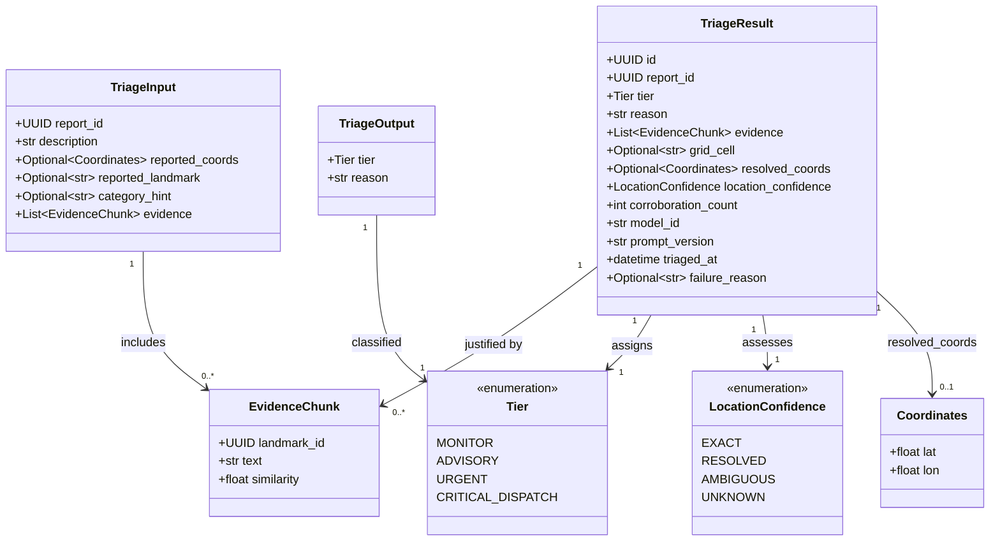
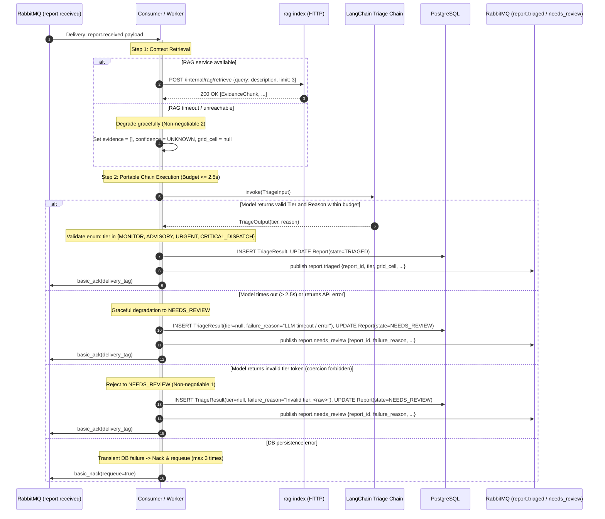
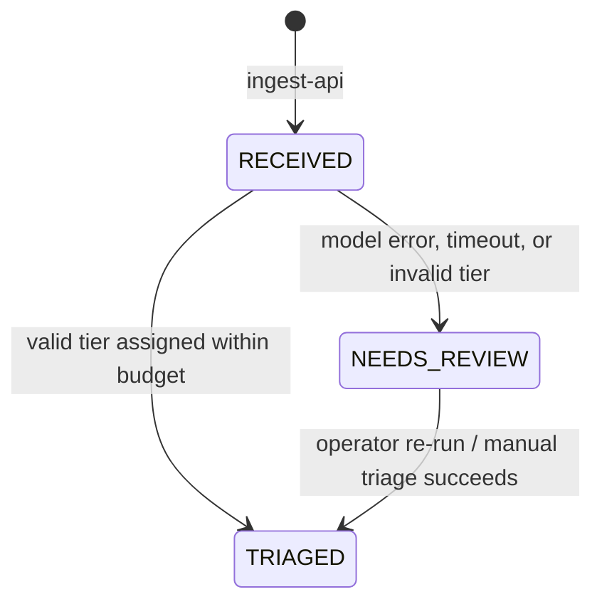

# Design — `triage-engine`

**Status:** `agreed` · **Owner:** Katlego (Gemini) · **Tasks:** `T003` ·
**Spec:** [SPEC.md](../../SPEC.md) `US2, US6` · **Domain Model:** [domain-model.md](domain-model.md)

---

## 1. What this covers

The `triage-engine` service is responsible for consuming newly ingested incident reports from RabbitMQ,
enriching them with landmark evidence retrieved from `rag-index`, invoking a portable LangChain
triage chain to classify the incident into exactly one of four priority tiers with an explanatory
reason, validating the result against strict grounding and enum invariants, persisting the
`TriageResult`, and publishing downstream events.

It explicitly does **not** cover:
- HTTP report ingestion or client response deadlines (covered by `docs/design/ingest.md`).
- Landmark vector embedding, indexing, or storage (covered by `docs/design/rag.md`).
- Multi-report spatial/temporal corroboration and incident clustering (covered by `docs/design/verification.md`).

---

## 2. Reference material

| Kind | Where |
| --- | --- |
| Shared domain model | [docs/design/domain-model.md](domain-model.md) §3 (`TriageResult`), §4 (flow + failure table), §5 (state machine), §6 (AMQP contracts) |
| User stories | [SPEC.md](../../SPEC.md) `US2` (triage tiers + reasons), `US6` (chain portability) |
| Architecture principles | [PLAN.md](../../PLAN.md) Non-negotiable 1 (grounded triage), 2 (graceful degradation), 8 (explainability) |
| Schema contracts | `packages/contracts/gridlock_contracts/` (`Tier`, `ReportState`, `LocationConfidence`, `TriageResult`) |

---

## 3. Domain model

The data structures consumed, produced, and manipulated by `triage-engine`:



### Invariants & Business Rules

1. **Strict 4-Tier Enum**: `tier` must be one of `MONITOR`, `ADVISORY`, `URGENT`, `CRITICAL_DISPATCH`. If the model emits any other token or formatting error, the output is rejected without coercion, setting `Report.state = NEEDS_REVIEW` and recording the raw token in `failure_reason`.
2. **Grounded One-Sentence Reason**: `reason` must be a single non-empty sentence. It must cite or paraphrase only facts stated in `description` or retrieved in `evidence`. It must never extrapolate unmentioned weapons, suspects, or severities.
3. **No Location Hallucination**:
   - If device GPS was submitted: `location_confidence = EXACT`, `grid_cell` resolved from coords.
   - If a single landmark matched above threshold: `location_confidence = RESOLVED`, `grid_cell` taken from landmark.
   - If multiple competing landmarks matched: `location_confidence = AMBIGUOUS`, `grid_cell = null`, `resolved_coords = null`.
   - If no match or index unreachable: `location_confidence = UNKNOWN`, `grid_cell = null`, `resolved_coords = null`.
   - Database check constraints strictly enforce `grid_cell IS NULL` when `location_confidence IN ('AMBIGUOUS', 'UNKNOWN')`.
4. **P95 Latency Budget**: Total execution budget from message consumption to persistence is ≤ 3.0s (p95). The LLM call has a hard timeout of 2.5s.
5. **Initial Corroboration**: `corroboration_count` defaults to 1 upon initial triage; subsequent incrementing is exclusively managed by `verifier`.

---

## 4. Flow & Failure Paths

### Primary Processing Sequence



### Detailed Failure Handling Matrix

| Failure Mode | Detection | System Action | Downstream Impact |
|---|---|---|---|
| `rag-index` connection error or timeout | HTTP client exception or timeout > 500ms | Catch exception, fallback to `evidence = []`, `location_confidence = UNKNOWN`, `grid_cell = null`. Reason explicitly notes landmark could not be verified. | Report is still triaged based on text content. No data loss. |
| LLM API rate limit / 5xx / timeout (> 2.5s) | `asyncio.TimeoutError` or model provider exception | Catch exception, set `Report.state = NEEDS_REVIEW`, record error in `failure_reason`. Ack AMQP message immediately. | Surfaces immediately in responder console `Needs review` pane. No retry storm. |
| Model hallucinates non-enum tier | Schema/Pydantic validation error | Catch validation error, set `Report.state = NEEDS_REVIEW`, record `failure_reason = "Unrecognized tier: {raw}"`. Ack AMQP message. | Responder manually assigns tier. Zero invented tiers reach dispatch. |
| Database connection down | `psycopg` / DB driver error | `basic_nack(requeue=true)`. After 3 attempts, RabbitMQ DLX routes to `gridlock.dlq`. | Page-worthy alarm. Prevents message loss while DB recovers. |
| Malformed JSON message on queue | JSON decode failure | Reject message to DLQ (`basic_reject(requeue=false)`). | Poison pill isolated; pipeline remains unblocked. |

---

## 5. State Machine

The states of `Report` touched by `triage-engine`:



Any transition not drawn (such as `RECEIVED -> RESOLVED` directly or `TRIAGED -> RECEIVED`) is prohibited.

---

## 6. Contracts & Chain Specification

### 6.1 Portable Chain Signature (US6)

Per US6, the core triage chain module must depend **only** on LangChain abstractions, standard library, and Pydantic models. It must have **zero imports** from `fastapi`, `sqlalchemy`, `aio_pika`, or database drivers.

```python
# services/triage-engine/src/gridlock_triage/chain.py
from typing import Protocol
from pydantic import BaseModel, Field
from gridlock_contracts.enums import Tier

class TriageChainInput(BaseModel):
    description: str = Field(..., min_length=1, max_length=2000)
    category_hint: str | None = None
    evidence_text: str = ""

class TriageChainOutput(BaseModel):
    tier: Tier
    reason: str = Field(..., min_length=5, max_length=500)

class TriageChainProtocol(Protocol):
    async def atriage(self, input_data: TriageChainInput) -> TriageChainOutput:
        """Asynchronously executes triage prompt against configured LLM."""
        ...
```

### 6.2 Prompt File Format & Versioning

Prompts reside outside application code in versioned files:
- **Location:** `services/triage-engine/prompts/triage_v1.prompt`
- **Derivation of `prompt_version`:** A deterministic SHA-256 hash (first 12 hex characters) computed from the normalized UTF-8 prompt template text, prefixed by the base filename: e.g., `triage_v1:a8f9c2d10e4b`.
- **Loading mechanism:** Loaded at service initialization. Any change to prompt file contents automatically yields a new `prompt_version` in all emitted `TriageResult` records.

#### Prompt Template Specification

```text
You are the GridLock safety triage engine for South African community reports.
Evaluate the reported incident and classify it into EXACTLY ONE priority tier.

TIER DEFINITIONS:
- CRITICAL_DISPATCH: Active, violent crime or imminent threat to life in progress (e.g. armed robbery, home invasion, active shooting, kidnapping, severe assault, structure fire with people trapped).
- URGENT: Serious property crime in progress, burglary with suspects on site, domestic disturbance without weapons visible, suspicious persons attempting entry, violent crime occurred within past 15 minutes.
- ADVISORY: Non-violent crime discovered after the fact (theft out of motor vehicle overnight, vandalism), suspicious activity without immediate threat (prowler seen earlier, suspicious lingering car), major physical hazard (open electrical box).
- MONITOR: Non-urgent municipal complaints (noise complaints, streetlights out, illegal dumping, bylaws, stray pets).

GROUNDING RULES:
1. Base your classification ONLY on the provided report description and retrieved landmarks.
2. Do NOT invent details, weapons, or severities not present in the text.
3. Reason must be exactly ONE sentence summarizing the core factual justification.

REPORT DETAILS:
Description: {description}
Category Hint: {category_hint}
Retrieved Landmark Evidence: {evidence_text}

Respond in valid JSON matching this schema:
{
  "tier": "CRITICAL_DISPATCH" | "URGENT" | "ADVISORY" | "MONITOR",
  "reason": "<One clear factual sentence justifying the tier>"
}
```

### 6.3 Operational Tier Criteria Table

To ensure consistency across human operators and AI runs:

| Tier | Operational Trigger | Typical Incidents | Prohibited Classifications |
|---|---|---|---|
| `CRITICAL_DISPATCH` | Immediate threat to human life or physical safety actively in progress. | Armed home invasion in progress; active gunfire; hostage / kidnapping; armed robbery with weapon brandished; severe physical assault happening now. | Break-in discovered after suspects left; threats made over text/phone; theft without weapons. |
| `URGENT` | High-risk property crime in progress, or serious threat without confirmed deadly weapons, or recent violent crime (suspects nearby). | Suspects jumping wall into property; break-in in progress while house is unoccupied; street mugging just occurred 2 mins ago; trespassing with burglary tools. | Noise disturbance; stolen vehicle parked overnight; streetlight outage. |
| `ADVISORY` | Past incidents without ongoing threat; suspicious circumstances without overt violence; public safety infrastructure hazards. | Car broken into overnight; house broken into earlier during the day; suspicious car idling without occupants for days; open stormwater drain. | Active screams for help; armed attackers on premises. |
| `MONITOR` | Low-priority municipal, nuisance, or quality-of-life reports. | Late night loud music; dog barking; illegal dumping; water leak on verge; potholes. | Any report involving violence, threats, or active intruders. |

---

## 7. Structure

Files created or modified for `triage-engine`:

| Path | New? | Responsibility |
|---|---|---|
| `services/triage-engine/pyproject.toml` | new | Pinned Python 3.13 dependencies (LangChain, pydantic, aio-pika, psycopg) |
| `services/triage-engine/prompts/triage_v1.prompt` | new | Canonical prompt template file |
| `services/triage-engine/src/gridlock_triage/__init__.py` | new | Package initialization |
| `services/triage-engine/src/gridlock_triage/chain.py` | new | Pure LangChain chain implementation (no transport/storage imports) |
| `services/triage-engine/src/gridlock_triage/prompt_loader.py` | new | File loader and SHA-256 `prompt_version` calculator |
| `services/triage-engine/src/gridlock_triage/rag_client.py` | new | HTTP client for calling `rag-index` retrieval endpoint |
| `services/triage-engine/src/gridlock_triage/repository.py` | new | PostgreSQL persistence for `TriageResult` and state updates |
| `services/triage-engine/src/gridlock_triage/consumer.py` | new | RabbitMQ worker consuming `report.received` and publishing downstream |
| `services/triage-engine/tests/test_chain_isolation.py` | new | AST / import-graph test enforcing US6 |
| `services/triage-engine/tests/test_chain_logic.py` | new | Unit tests for prompt formatting, output parsing, and tier validation |
| `services/triage-engine/tests/test_consumer.py` | new | Integration tests for worker flows, error fallbacks, and DLQ handling |

---

## 8. Decisions & Alternatives

| Decision | Chosen | Rejected, and why |
|---|---|---|
| Portability boundary | LangChain primitives (`RunnableSequence`, `ChatPromptTemplate`) decoupled from transport | Direct HTTP calls to OpenAI/Anthropic SDKs. Rejected: brief mandates portability (Python MVP, possible future Java/Spring AI migration). |
| Out-of-spec tier handling | Immediate rejection to `ReportState.NEEDS_REVIEW` | Tier coercion (e.g. mapping "HIGH" to "URGENT"). Rejected: coercing invents dispatch decisions that neither human nor system intended. |
| Prompt versioning | SHA-256 hash of template file content | Manual semantic version strings in code. Rejected: manual versions drift when developers tweak prompts without updating strings. |
| Model failure handling | Route to `NEEDS_REVIEW`, ack AMQP message | Requeueing message with exponential backoff. Rejected: prevents retry storm during API outages and ensures report is immediately visible to responders. |
| Transport dependencies in chain | Strict zero-import policy enforced by AST test | Importing db models directly into chain. Rejected: violates US6 and makes unit testing require database mocks. |

---

## 9. How this is verified

1. **Import Graph Isolation Test (US6)**:
   - A pytest test parses the AST of `gridlock_triage.chain` and asserts that none of `fastapi`, `starlette`, `sqlalchemy`, `aio_pika`, `psycopg`, or `requests` appear anywhere in imported modules.
2. **Deterministic Tier Classification Tests**:
   - Using a mock chat model, verify all 4 tiers parse correctly.
   - Verify that invalid string outputs (e.g. `"HIGH"`, `"CRITICAL"`, `"URGENT!"`) raise validation errors and do not coerce.
3. **Timeout & Failure Path Verification**:
   - Simulate a 3.5s delay in LLM call; verify timeout triggers within 2.5s, `ReportState` becomes `NEEDS_REVIEW`, and AMQP message is acked.
   - Simulate `rag-index` connection failure; verify chain proceeds with empty evidence and `location_confidence = UNKNOWN`.
4. **Prompt Hash Immutability**:
   - Changing one character in `triage_v1.prompt` alters `prompt_version` string.

---

## 10. Open questions

- None blocking Phase 1 or 2 implementation. Grounding criteria, failure paths, and contracts are fully specified.
