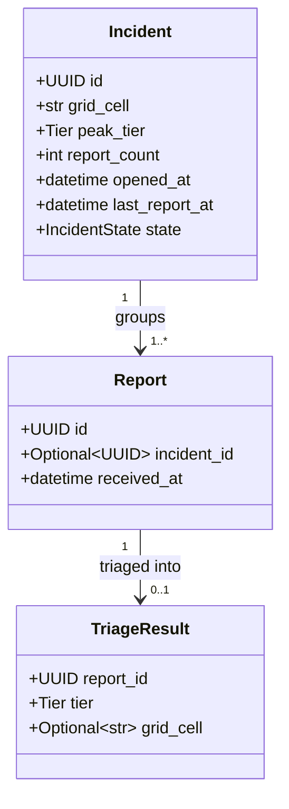
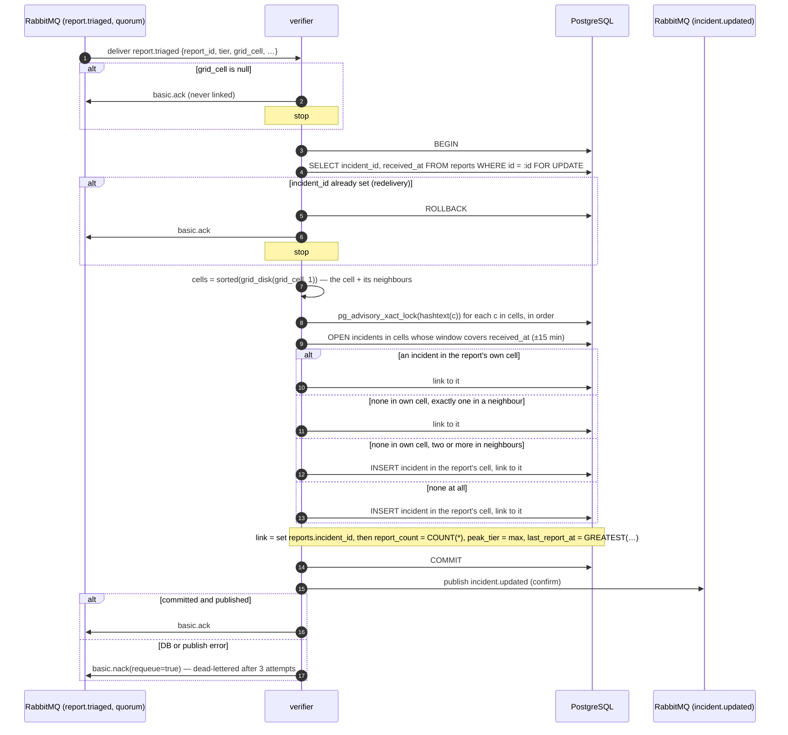
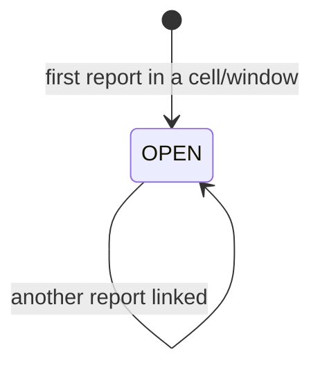

# Design — `verifier`

**Status:** `draft` (Phase 0 fixes under review) · **Owner:** Katlego (Gemini; revised by Claude) ·
**Tasks:** `T004` · **Spec:** `US4` · **Domain model:** [domain-model.md](domain-model.md)

---

## 1. What this covers

`verifier` consumes `report.triaged`, links the report to an `Incident` when another report landed in
the same or an adjacent H3 cell within the time window, and publishes `incident.updated`. It also
records GridLock's grid-cell decision: **H3, resolution 9**.

It does **not** compute cells (`gridlock_contracts.geo.cell_for`, shared by every service), assign
tiers (`triage.md`), resolve landmarks (`rag.md`) or serve the queue — `corroboration_count` is
computed by `ingest-api` at read time (`ingest.md` §6.3).

---

## 2. Reference material

| Kind | Where |
| --- | --- |
| Shared domain model | [domain-model.md](domain-model.md) §3 (`Incident`, derived `corroboration_count`), §5 (incident state), §6 (AMQP, delivery semantics) |
| User story | `US4` (corroborate reports inside a grid cell) |
| Governing rule | Corroboration is a count of persisted rows, never a model opinion. A report with no location is never linked. |
| External standard | H3 v4, <https://h3geo.org/> — Python binding `h3` 4.x. Resolution 9: average area 0.105 km², average edge ≈ 201m, neighbouring cell centres ≈ 350–370m apart. |

---

## 3. Domain model

`Incident` is exactly domain-model §3. `Report` and `TriageResult` below show only the fields this
service reads or writes.



### Invariants

1. **The count is a count.** A report's corroboration is `COUNT(*)` of reports sharing its
   `incident_id`, computed at read time. This service never writes a count onto a report or result.
   `Incident.report_count` is kept equal to that count, in the same transaction as each link, for the
   `incident.updated` payload only.
2. **No location, no incident.** A report whose `grid_cell` is null is never linked and never opens
   an incident. It reads `1 report`.
3. **`peak_tier` never decreases.** It is the highest tier among the incident's reports
   (`CRITICAL_DISPATCH` > `URGENT` > `ADVISORY` > `MONITOR`).
4. **Report time, not processing time.** The window uses `Report.received_at`, read from the
   database (it is not in the `report.triaged` payload). `last_report_at = GREATEST(last_report_at,
   received_at)`, so a report that is triaged late never moves an incident backwards in time.
5. **One linking decision per cell at a time.** Linking takes transaction-scoped advisory locks on
   the report's cell and its neighbours, in sorted order (§4.1), so two reports arriving together
   cannot each open a separate incident.
6. **Idempotent.** A report that already has an `incident_id` is acked without changes.

---

## 4. Flow

### 4.1 Linking a triaged report



The candidate query (step 9):

```sql
SELECT id, grid_cell FROM incidents
 WHERE state = 'OPEN'
   AND grid_cell = ANY(:cells)
   AND last_report_at >= :received_at - interval '15 minutes'
   AND opened_at      <= :received_at + interval '15 minutes';
```

With the locks held, at most one open in-window incident can exist per cell, because any second
report in that cell would have found the first. If the query ever returns two in the report's own
cell, that is a bug: the transaction aborts and the message goes through the nack/DLQ path, rather
than picking one.

If the commit succeeds but the publish fails, redelivery hits the idempotency branch and acks
without re-publishing. `incident.updated` is a notification and the console reads the database, so a
lost notification delays nothing a responder sees.

`report.needs_review` is not consumed (domain-model §6): a report whose triage failed is not
corroborated in the MVP.

### 4.2 Boundary cases (US4)

The example cells are real H3 res-9 cells around (-26.2361, 27.9068), Vilakazi Street, Orlando West.

| Case | Scenario | Decision | Why |
| --- | --- | --- | --- |
| Same cell, in window | Two reports in `89bcc3cc96bffff`, 4 min apart | Linked; each reads `2 reports` | Same place, same burst |
| Same cell, out of window | 10:00 and 13:00 in the same cell | Not linked; the second opens a new incident and reads `1 report` | Outside 15 min of the incident's last report |
| Adjacent cell, one candidate | Report in `89bcc3cc96bffff`, open incident in neighbour `89bcc3cc963ffff` | Linked to that incident | A boundary between two cells is not a boundary between two events |
| Adjacent cells, several candidates | Open incidents in two different neighbours | Not linked to either; opens its own incident | Linking would silently join two events through one report |
| Sliding window | 12:00, 12:10, 12:22 in one cell | All three linked | 12:10 is within 15 min of 12:00; 12:22 within 15 min of 12:10 |
| Late triage | Report received 12:05, triaged 12:30; incident's last report 12:12 | Linked; `last_report_at` stays 12:12 | The window compares report times, not processing times |
| No location | `grid_cell` null | Never linked; reads `1 report` | A location is never guessed to make a count |

What a linked count means, stated on the card per US4: *reports in this cell or an adjacent one
(≈ 350m), each within 15 minutes of the previous*.

---

## 5. State



`CLOSED` and `MERGED` are reserved enum values with no designed trigger (domain-model §10); this
service never writes them. An incident's linking life ends when its window lapses, not when a
state changes.

---

## 6. Contracts

### 6.1 Consumes

Queue `verifier.report_triaged` (quorum, `x-delivery-limit` per domain-model §6), bound to
`report.triaged` on exchange `gridlock`. Payload exactly as domain-model §6:

```json
{
  "report_id": "UUID string",
  "tier": "URGENT",
  "grid_cell": "89bcc3cc96bffff",
  "resolved_coords": {"lat": -26.2361, "lon": 27.9068},
  "location_confidence": "RESOLVED",
  "triaged_at": "2026-09-29T12:00:03.000000Z"
}
```

### 6.2 Publishes

Routing key `incident.updated`, payload exactly as domain-model §6 — no extra fields:

```json
{
  "incident_id": "UUID string",
  "grid_cell": "89bcc3cc96bffff",
  "report_count": 3,
  "peak_tier": "URGENT"
}
```

### 6.3 Cells

- Format: H3 index as a 15-character lowercase hex string, stored `VARCHAR(15)`, indexed.
- Computed only by `gridlock_contracts.geo.cell_for(lat, lon)` → `h3.latlng_to_cell(lat, lon, 9)`.
- Neighbours: `h3.grid_disk(cell, 1)` — the cell plus its neighbours. That is six for a hexagon;
  H3 has twelve pentagon cells per resolution with five, so the code iterates what `grid_disk`
  returns and never assumes a count.

---

## 7. Structure

| Path | New? | Responsibility |
| --- | --- | --- |
| `services/verifier/pyproject.toml` | new | Pinned deps: `h3` 4.x, psycopg, aio-pika, pydantic, `gridlock-contracts` |
| `services/verifier/src/gridlock_verifier/clustering.py` | new | The §4.1 decision, as a pure function of (report, candidate incidents) |
| `services/verifier/src/gridlock_verifier/repository.py` | new | Advisory locks, candidate query, link, count |
| `services/verifier/src/gridlock_verifier/consumer.py` | new | Consume, transaction, publish, ack |
| `services/verifier/tests/test_clustering.py` | new | Every §4.2 row |
| `services/verifier/tests/test_concurrency.py` | new | Simultaneous reports, redelivery |

---

## 8. Decisions and alternatives

| Decision | Chosen | Rejected, and why |
| --- | --- | --- |
| Grid scheme | **H3 res 9** | Geohash: US4's boundary rule needs "the cells next to this one", and a geohash cell has eight neighbours at two distances (edge and corner), so "adjacent" would mean different distances in different directions. H3 gives six neighbours at one distance from one library call. Cost: a compiled dependency. |
| Resolution | 9 (≈ 0.1 km², neighbours ≈ 350m) | 8 (≈ 0.7 km²): a cell spans several streets, so unrelated reports corroborate. 10 (≈ 0.015 km²): two people reporting from either end of one street land in cells that are not even adjacent. |
| Window | Sliding, 15 min from the incident's last report | Fixed clock buckets split a burst at 12:14/12:16 in two. The 15 minutes itself is still unresearched (domain-model §10). |
| Several adjacent incidents | Open a new incident | Joining the nearest: silently merges two events through one report. |
| Concurrent reports | Advisory locks on the cell and its neighbours, sorted | `SELECT … FOR UPDATE` alone: locks nothing when no incident exists yet, so two first reports each open one. |
| Where the count lives | Read-time `COUNT(*)` | Writing counts onto results: a second copy of the truth that can drift. |

Deviations from the locked stack: `h3` is a new dependency (compiled, MIT-licensed), recorded here.

---

## 9. How this is verified

1. **Same cell** — reports at t = 0, 4, 10 min in one cell → one incident, each reads `3 reports`
   (US4's main scenario).
2. **Window expiry** — t = 0 and t = 16 min → two incidents, each `report_count = 1`.
3. **One neighbour** — incident in A, report in a neighbour of A at t = 3 min → linked, count 2.
4. **Two neighbours** — incidents in two non-adjacent cells that share a neighbour C; report in C →
   a third incident, neither existing one changes.
5. **No location** — `grid_cell = None` → no incident, reads `1 report`.
6. **Late triage** — the §4.2 late-triage row: linked, and `last_report_at` does not move backwards.
7. **Concurrency** — 10 reports for one empty cell processed in parallel → exactly one incident with
   `report_count = 10`.
8. **Redelivery** — the same `report.triaged` twice → one link, count unchanged.
9. **Cells are computed** — tests call `cell_for()`; no hard-coded cell string is used as an
   expected value.

---

## 10. Open questions

- [ ] **Window length** — 15 min is a starting value (domain-model §10).
- [ ] **Closing and merging** — no trigger for `CLOSED`/`MERGED` (domain-model §10).
- [ ] **Corroborating failed-triage reports** — a report whose tier failed but whose location
      resolved could still count. Excluded for the MVP; revisit once the needs-review rate is known.
