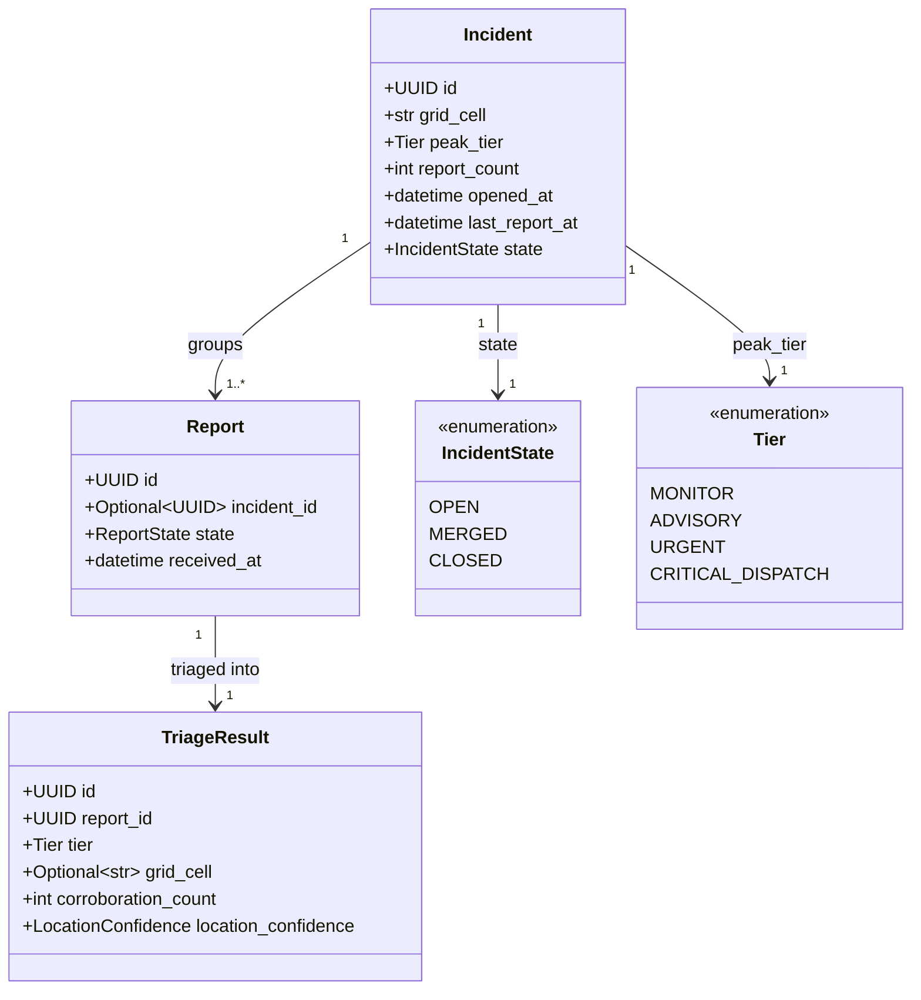
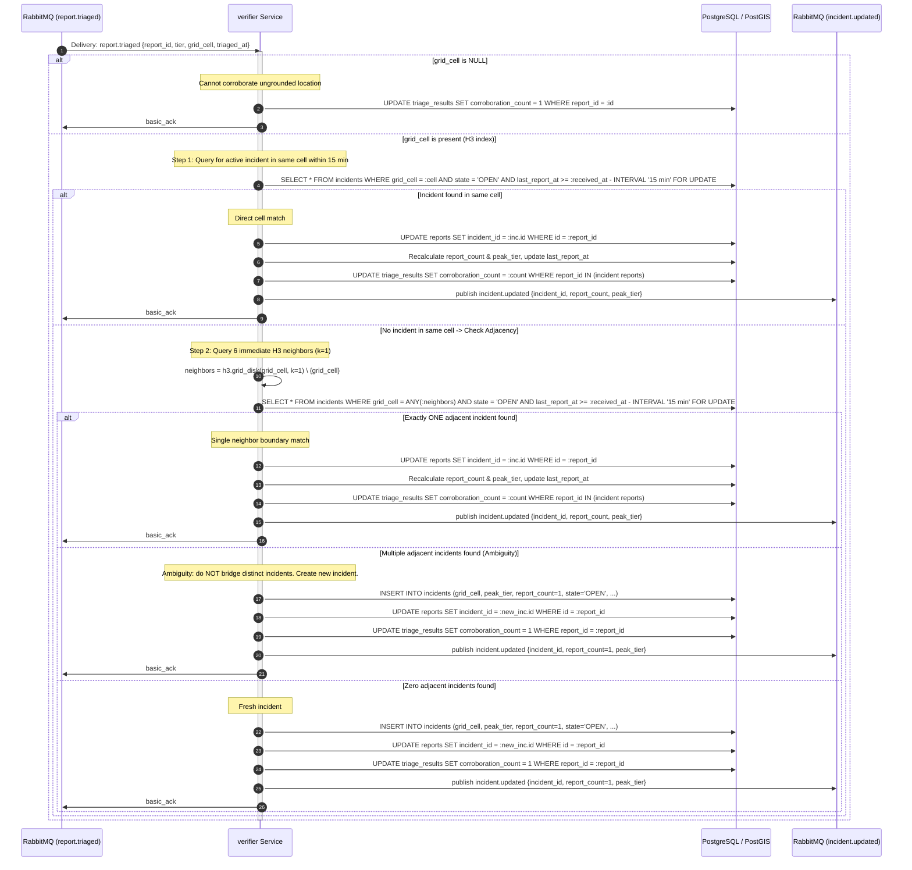
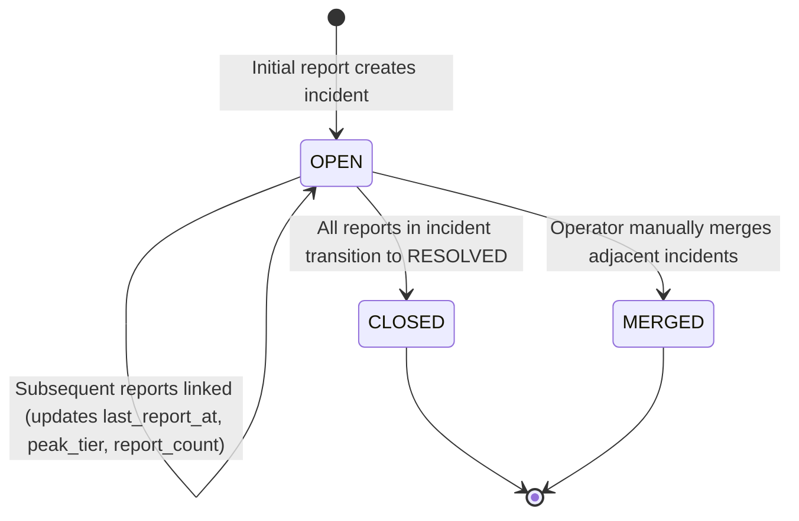

# Design — `verifier`

**Status:** `agreed` · **Owner:** Kamo (Gemini) · **Tasks:** `T004` ·
**Spec:** [SPEC.md](../../SPEC.md) `US4` · **Domain Model:** [domain-model.md](domain-model.md)

---

## 1. What this covers

The `verifier` service is responsible for consuming `report.triaged` (and `report.needs_review`) messages
from RabbitMQ, grouping related reports into cohesive `Incident` records based on geographic grid cells
and temporal proximity, and maintaining an exact, deterministic `corroboration_count` across all reports
linked to each incident.

It explicitly:
1. Defines and adopts **Uber H3 (Resolution 9)** as GridLock's spatial grid-cell scheme.
2. Formalizes the **15-minute sliding time window** and the deterministic **boundary adjacency rule**.
3. Manages the `Incident` lifecycle (`OPEN`, `CLOSED`, `MERGED`) and peak priority tier propagation.
4. Publishes `incident.updated` events for responder notifications and console queue invalidation.

It explicitly does **not** cover:
- Textual report classification or priority tier assignment (covered by `docs/design/triage.md`).
- Landmark vector search or geolocation retrieval (covered by `docs/design/rag.md`).
- HTTP report intake or queue serving (covered by `docs/design/ingest.md`).

---

## 2. Reference material

| Kind | Where |
| --- | --- |
| Shared domain model | [docs/design/domain-model.md](domain-model.md) §3 (`Incident`, `Report`, `TriageResult`), §4 (flow), §5 (state), §6 (AMQP contract), §10 (Open Question 1) |
| User story | [SPEC.md](../../SPEC.md) `US4` (corroborate reports inside a grid cell) |
| Architecture principles | [PLAN.md](../../PLAN.md) Non-negotiable 1 (corroboration is a count of persisted rows, never a model opinion) |
| External standard | [Uber H3 Hierarchical Hexagonal Spatial Index](https://h3geo.org/) (Resolution 9: ~0.105 km², edge ~174m) |

---

## 3. Domain model



### Invariants & Inviolable Rules

1. **Deterministic Count**: `corroboration_count` equals `COUNT(DISTINCT r.id)` for all reports sharing the `incident_id`. It is an exact database count. A model is never asked whether reports describe the same incident.
2. **Single-Report Base Case**: If a report does not link to any existing incident, a new incident is created with `report_count = 1`, and the report's `corroboration_count` is set to `1`.
3. **Null Cell Exclusivity**: If a report has `grid_cell IS NULL` (due to `LocationConfidence` being `UNKNOWN` or `AMBIGUOUS`), it is **never** attached to an incident. It remains `incident_id = NULL` with `corroboration_count = 1`.
4. **Peak Tier Monotonicity**: An incident's `peak_tier` is the mathematical maximum severity of all linked reports (`CRITICAL_DISPATCH` > `URGENT` > `ADVISORY` > `MONITOR`). It never decreases as new reports arrive.
5. **Timestamp Source**: Time calculations strictly use the server-assigned `Report.received_at`.

---

## 4. Flow & The Corroboration Algorithm

### 4.1 Processing Flow



### 4.2 Edge & Boundary Case Rules (SPEC US4)

| Case | Scenario | Verifier Decision | Justification |
|---|---|---|---|
| **Same cell, within 15 min** | Reports A and B fall in H3 cell `89196b26d83ffff`, received 4 mins apart. | **Linked** to same incident. `corroboration_count = 2`. | Standard temporal and spatial convergence. |
| **Same cell, outside 15 min** | Report A received at 10:00; Report B received in same cell at 13:00. | **Not linked**. Report B creates new incident with `corroboration_count = 1`. | Exceeds the 15-minute sliding window; represents a separate event. |
| **Adjacent boundary cells** | Report A in cell 1; Report B in neighbor cell 2 within 15 min. Only one open incident exists among neighbors. | **Linked** to the existing incident. | H3 hexagons have identical centroid distances to all 6 neighbors (~300m), cleanly absorbing boundary fuzziness. |
| **Conflicting neighbor cells** | Report C falls on the boundary between Incident 1 (north neighbor) and Incident 2 (south neighbor). | **Not linked** to either. Creates new incident in cell C. | Prevents accidental transitive merging of two large independent events across a suburb. |
| **Sliding window chaining** | Report 1 at 12:00, Report 2 at 12:10, Report 3 at 12:22. | **All 3 linked**. `corroboration_count = 3`. | Window slides with `last_report_at`: 12:10 is within 15m of 12:00, and 12:22 is within 15m of 12:10. |
| **Null location report** | Report submitted without coords or landmark. | **Never linked** (`incident_id = null`, `corroboration_count = 1`). | Non-negotiable 1: Never guess or infer location to corroborate. |

---

## 5. State Machine



---

## 6. Contracts & Interfaces

### 6.1 AMQP Consumption Contract

- **Exchange:** `gridlock` (topic, durable)
- **Queues:** `verifier.report_triaged`, `verifier.report_needs_review`
- **Routing keys:** `report.triaged`, `report.needs_review`
- **Incoming Payload (`report.triaged`):**
  ```json
  {
    "report_id": "UUID string",
    "tier": "CRITICAL_DISPATCH",
    "grid_cell": "89196b26d83ffff",
    "resolved_coords": {"lat": -26.2361, "lon": 27.9068},
    "location_confidence": "RESOLVED",
    "triaged_at": "2026-09-29T12:00:03.000000Z"
  }
  ```

### 6.2 AMQP Publication Contract

- **Exchange:** `gridlock` (topic, durable)
- **Routing key:** `incident.updated`
- **Payload:**
  ```json
  {
    "incident_id": "UUID string",
    "grid_cell": "89196b26d83ffff",
    "report_count": 3,
    "peak_tier": "CRITICAL_DISPATCH",
    "updated_at": "2026-09-29T12:00:04.000000Z"
  }
  ```

### 6.3 H3 Cell Format Specification

- `grid_cell` is stored as an **indexed lowercase 15-character hex string** representing an H3 index (e.g. `89196b26d83ffff`).
- Library: `h3` Python bindings (version 4.x).
- Resolution: **Resolution 9** (hex area = 0.105 km², average hexagon radius ~174m, edge length ~174m, spacing between centroids ~300m).

---

## 7. Structure

Files created or modified in `services/verifier`:

| Path | New? | Responsibility |
|---|---|---|
| `services/verifier/pyproject.toml` | new | Python 3.13 dependencies: `h3`, `psycopg`, `aio-pika`, `pydantic` |
| `services/verifier/src/gridlock_verifier/__init__.py` | new | Package initialization |
| `services/verifier/src/gridlock_verifier/geo.py` | new | H3 cell computation (`geo_to_h3`), neighbor ring generation (`grid_disk`) |
| `services/verifier/src/gridlock_verifier/clustering.py` | new | Corroboration logic, window evaluation, and adjacency matching |
| `services/verifier/src/gridlock_verifier/repository.py` | new | Database queries for locking incidents and atomically updating report counts |
| `services/verifier/src/gridlock_verifier/consumer.py` | new | RabbitMQ listener for `report.triaged` and publisher for `incident.updated` |
| `services/verifier/tests/test_h3_geo.py` | new | Tests for coordinate-to-cell mapping and neighbor resolution |
| `services/verifier/tests/test_clustering_window.py` | new | Tests verifying the 15-minute sliding window boundary |
| `services/verifier/tests/test_boundary_adjacency.py` | new | Tests verifying exact cell, single neighbor, and multi-neighbor conflict cases |

---

## 8. Decisions & Alternatives

### 8.1 Grid Scheme Decision: Uber H3 vs. Geohash

| Evaluation Dimension | Uber H3 (Resolution 9) [CHOSEN] | Geohash (Prefix length 6/7) [REJECTED] |
|---|---|---|
| **Adjacency Uniformity** | **Uniform.** Every cell is a regular hexagon with exactly 6 neighbors at identical centroid distances (~300m). | **Non-uniform.** Rectangles have 8 neighbors (4 orthogonal, 4 diagonal). Diagonal cells are ~1.414x further away. |
| **Boundary Cliff Effect** | Continuous and uniform. No catastrophic coordinate jumps. | Severe cliff edges at quadrant transitions (e.g. adjacent points having completely different string prefixes). |
| **Area & Shape Distortion** | Minimal distortion across latitudes (hexagonal projection preserves near-constant area). | Significant aspect ratio stretching away from the equator. |
| **Neighbor Query Complexity** | Native `h3.grid_disk(origin, k=1)` function returns exactly 7 cells in O(1). | Requires complex quadrant neighbor calculations with uneven bounding boxes. |
| **String Representation** | Hex string (`89196b26d83ffff`), 15 chars. Fits standard SQL `VARCHAR(16)` column. | Base32 string (6–7 chars). |

**Decision:** **Adopt Uber H3 Resolution 9.** The slight cost of a C-extension dependency (`h3-py`) is overwhelmingly outweighed by the complete elimination of geohash boundary distortion and diagonal-distance anomalies.

### 8.2 Sliding Window vs. Fixed Epoch Window

- **Chosen:** Sliding window anchored to `Incident.last_report_at` (15 minutes).
- **Rejected:** Fixed clock epochs (e.g. 12:00–12:15, 12:15–12:30). Fixed intervals arbitrarily split a single burst occurring at 12:14 and 12:16 into two distinct incidents.

---

## 9. How this is verified

1. **Exact Cell Clustering Test**:
   - Ingest 3 reports at $t=0$, $t=4\text{m}$, $t=10\text{m}$ in cell `89196b26d83ffff`.
   - Assert all 3 share the same `incident_id` and all 3 have `corroboration_count = 3`.
2. **Window Expiry Test**:
   - Ingest report 1 at $t=0$; report 2 at $t=16\text{m}$ in the same cell.
   - Assert 2 separate incidents exist, each with `report_count = 1`.
3. **Neighbor Boundary Test**:
   - Report 1 in cell $A$; Report 2 in adjacent cell $B \in \text{grid\_disk}(A, 1)$ at $t=3\text{m}$.
   - Assert Report 2 links to Report 1's incident; incident records both reports and `corroboration_count = 2`.
4. **Multiple Neighbor Conflict Test**:
   - Create Incident 1 in cell $A$ and Incident 2 in cell $B$ (where $A$ and $B$ are non-adjacent).
   - Ingest Report 3 into cell $C$ which is adjacent to **both** $A$ and $B$.
   - Assert Report 3 does **not** merge $A$ and $B$, but creates Incident 3 in cell $C$.
5. **Null Location Test**:
   - Ingest report with `grid_cell = None`.
   - Assert no incident is created, `incident_id` remains `None`, and `corroboration_count = 1`.

---

## 10. Open questions

- None. Open Question 1 from `docs/design/domain-model.md` §10 is resolved by the adoption of H3 Resolution 9 and the boundary rules above.
